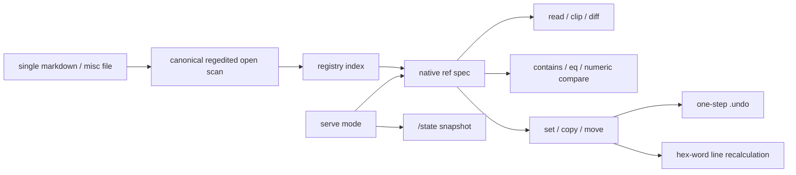

### So I rewrote the windows registry in rust.

What makes `regedit` so great? Built from an initial joke on “Why need a DB? You should dangerously grep a million-line markdown file” 

# Regedited

> The best way to predict the future is to invent it.
 	- Alan Kay

> The registry, edited. A fast plaintext parse-ment database with structured headers, typed hex-word offsets, and O(1) section jumps on multi-GB files.

Inspired by the [safetensors](https://github.com/huggingface/safetensors) format's ability to scan, diff, and replace keys in multi-gigabyte files without loading them into RAM — applied to structured markdown documents with full key-value semantics.

## Why It's Fast

Regedited memory-maps your file and builds an index from canonical `"regedited open"` triggers or compatible `## SECTION:` headers. A **10GB file with 1,000 sections uses ~200KB of Rust heap** — the file lives in OS-managed virtual memory, not your process RAM.

| Approach | 10GB File RAM | Section Jump |
|----------|--------------|--------------|
| `cat + grep` | 10GB | O(n) scan |
| Python `readlines()` | 10GB | O(1) — at a cost |
| **Regedited** | **~200KB** | **O(1) byte offset** |

The trick is the **hex-word line**: each section carries 6 typed line-number pointers (`TxLLLLLLL`) that encode both *where* content lives and *what type* it is. Change content, and all pointers recalculate automatically.

The newer native ref layer turns those low-level pointers into stable addresses such as `index:3:string:2`, `index:3:db:8`, `index:3:zone:1`, or `hex:0x0000020..0x0000028`. A ref can be read, copied, moved, diffed, compared, or served over HTTP without inventing a SQL schema.

---

## Opening an Index

### \``regedited open`\`

The trigger can appear **anywhere** in a line — inside HTML comments, JS block comments, shell comments, markdown, CSS, or plain inline text. The scanner only cares that the literal phrase "`regedited open`" appears in that line. Text before and after it is ignored; there is no canonical name on the trigger line. The index begins on the *following* line, and the numeric `index:` value is the address.

```html
<!-- arbitrary html comment text regedited open and this suffix is ignored
index: 500
0x0000000 : 0x0000000 : 0x0000000 : 0x0000000 : 0x0000000 : 0x0000000
...etc
-->

<!-- later on.... -->
somehtml <a href "mylink"
</body>
```

```javascript
/* regedited open
index: 600
0x0000000 : 0x0000000 : 0x0000000 : 0x0000000 : 0x0000000 : 0x0000000  <--- these define zones in the file. 1, 2, and 3 (for the index: #)
42 | 7 | 3 | 256 | 1024 | 4096 | 100 | 200 | 300
main.rs core logic
utility functions
database connection code
*/
javascript, do()
```

```bash
# regedited open
index: 700
...
```

```markdown
wdfkbsdfknwdbfkwbfkbwekfbwekfb**regedited open is here, ultra discretely**wjfjbwdkjfbwjnfbwjnf
index: 999
some range line of three ranges            (val:val : val:val : val:val) (defined as index ranges 1-3) <-- also easily piped to clipboard or diffed to different areas
some database of nine decimal 10 values    (can be if/then compared to other db-vals, also called from the index & value # .. 1-9)
some utility function                      <---
another string                             <---
the third and last string                  <---all these can be echoed to console and piped to clipboard — solely by the index & string number (1-3) 
...
```

The canonical section key for those examples is `index:500`, `index:600`, `index:700`, and `index:999`. If you want a human label, store it in one of the three string lines and read it with `index-str-list` or `ref-get index:<N>:string:<1-3>`.

The scanner uses zero-allocation exact byte search for the lowercase phrase `regedited open`. No `to_lowercase()`, no string allocations.

### Compatible: `## SECTION:` Headers (for markdown / other plaintext) — i.e. no different than `regedited open`

```markdown
## SECTION: CodeSnippets
index: 200
0x0000000 : 0x0000000 : 1x000003C : 1x000004A : 0x0000000 : 0x0000000
42 | 7 | 3 | 256 | 1024 | 4096 | 100 | 200 | 300
main.rs core logic
utility functions
database connection code
---
fn main() { ... }
```

`## SECTION:` remains fully supported for older markdown files and hand-authored documents.

---

## Hex-Word Format: `Tx0123456`

Each zone boundary is `TxLLLLLLL` where `T` = type digit (first character), `L` = line number (7 hex digits = 28 bits = 268M max lines):
> 7 values = 16^6 line maximum for values (16 million line maximum)

| Hex-Word | Type | Line | Meaning |
|----------|------|------|---------|
| `0x000000A` | Markdown (0) | 10 | Text at line 10 |
| `1x0000050` | Code (1) | 80 | Code at line 80 |
| `2x0000A00` | Media (2) | 2560 | Media at line 2560 |
| `3x0000001` | Database (3) | 1 | Data at line 1 |

The type digit is **immediately visible** as the first character — no bit-shifting to read it. 

(Convert base10 to base16 with simple math functions included for "plain linenum range to HexWord"
> `regedited convert 50 80 --zone-type code`

### Hex-Word Categories

The first nibble is the content category. It lets a plain line pointer carry both *address* and *intent*:

| Nibble | Category | Use |
|--------|----------|-----|
| `0` | Markdown/Text | Notes, docs, client comms, templates, prose |
| `1` | Code | Scripts, commands, config snippets, source blocks |
| `2` | Media | Image/audio/video references, asset manifests |
| `3` | Database | Structured blocks, generated tables, machine-owned data |
| `4-F` | Custom/Reserved | Domain-specific future lanes |

That category is why a single markdown file can act like a small database manager instead of a blob of text: Regedited knows which lines are prose, code, media, or structured data while still leaving the file human-readable.

## Command Overview

| Category | Key Commands | Purpose |
|----------|-------------|---------|
| **Scan** | `list`, `scan`, `db`, `hexline` (`ascii` legacy) | Inspect documents |
| **Grep** | `fgrep`, `fgrep-multi`, `grep` | Memory-mapped search |
| **Zone** | `zone-copy`, `zone-append`, `zone-replace`, `zone-extract` | Content manipulation |
| **Write** | `set-num`, `set-str`, `set-zone`, `add`, `rm` | Edit values |
| **Diff** | `diff`, `replace` | Safetensors-style patch |
| **Bool** | `bool-and`, `bool-nand`, `bool-or`, `bool-xor`, `count`, `if-contains` | Content logic |
| **Ref** | `ref-get`, `ref-set`, `ref-copy`, `ref-diff`, `ref-bool` | Address strings, DB values, zones, and hex ranges uniformly |
| **Index** | `index-str-list`, `index-zone-set-hex` | Work directly from registry indexes |
| **State** | `state`, `state-compare`, `undo` | Snapshot, compare, and one-step restore |
| **HTML** | `grab-html` | Attribute extraction |
| **Encap** | `encap` | Three-mode quoting (b/c/d) |
| **Serve** | `serve`, `/state`, `/ref`, `/ref-bool`, `/query` | HTTP registry runtime |
| **Util** | `types`, `convert`, `getutf`, `echo`, `clip` | Helpers |

See [docs/ARCHITECTURE.md](docs/ARCHITECTURE.md) for the complete command reference, format specification, Python integration guide, and internal architecture.

Beginner and shell-specific docs:

| Doc | Use |
|-----|-----|
| [docs/RUST_BEGINNER_SETUP.txt](docs/RUST_BEGINNER_SETUP.txt) | Install Rust, verify Cargo/rustc/rustup, build, test, and install `regedited` locally |
| [docs/shell/POWERSHELL.txt](docs/shell/POWERSHELL.txt) | PowerShell-native command examples, clipboard flow, refs, bools, serve mode |
| [docs/shell/BASH.txt](docs/shell/BASH.txt) | Bash/Linux/macOS-style command examples and pipes |
| [docs/shell/PYTHON.txt](docs/shell/PYTHON.txt) | Python subprocess examples for scripting Regedited from a managed runtime |

### Native Ref Specs

Ref specs are the command surface for every addressable thing in a Regedited file:

| Spec | Resolves To |
|------|-------------|
| `index:3:string:2` | String slot 2 on registry index 3 |
| `index:3:db:8` | Numeric DB slot 8 on registry index 3 |
| `index:3:dbline` | The full 9-number DB line |
| `index:3:hexline` | The full hex-word line |
| `index:3:zone:1` | Defined zone 1 content |
| `index:3:zonehex:1` | Defined zone 1 as `start : end` hex-words |
| `hex:0x0000020..0x0000028` | Literal line range |
| `text:hello` | Literal value |

```bash
# Read/copy/diff by address
regedited ref-get doc.md index:3:string:2
regedited ref-get doc.md index:3:zone:1 --clip
regedited ref-diff doc.md index:3:zone:1 index:4:zone:2

# Move content between arbitrary address types
regedited ref-copy doc.md index:3:zone:1 index:4:zone:2
regedited ref-set doc.md index:5:db:8 --text 42

# Boolean checks can compare strings or numbers
regedited ref-bool doc.md index:3:zone:1 contains waterfront
regedited ref-bool doc.md index:5:db:8 gte 10 --then-val HOT --else-val COLD
```



### Convert Line Ranges to Hex-Words

```bash
# What hex-words do I need for lines 50-80 of code?
regedited convert 50 80 --zone-type code
# Start: 1x0000032
# End:   1x0000050
#
# Paste into your .md:
# 1x0000032 : 1x0000050 : 0x0000000 : 0x0000000 : 0x0000000 : 0x0000000
```

### Zone Replace with Auto-Recalculation

```bash
# Replace zone 1 with new content (grows from 7 to 15 lines)
regedited zone-replace doc.md CodeSnippets 1 --text "$(cat new_code.rs)"
# Zone 1: 7 lines -> 15 lines (+8 delta)
# All subsequent hex-words shifted by +8 automatically
```

---

## Clipboard as Transport

Copy anything to your system clipboard for cross-platform pasting:

```bash
# Copy a manually-keyed hex-word range
regedited clip-hexword 50 80 --zone-type code
# -> "1x0000032 : 1x0000050" in clipboard

# Copy zone content by index (0-2)
regedited clip-zone doc.md CodeSnippets 1

# Copy a database value by index (0-8)
regedited clip-db doc.md CodeSnippets 0

# Copy the full database line
regedited clip-dbline doc.md CodeSnippets
# -> "42 | 7 | 3 | 256 | ..."

# Copy the hex-word line
regedited clip-hexline doc.md CodeSnippets
# -> "0x0000000 : 1x000003C : ..."

# Copy a string by index (0-2)
regedited clip doc.md CodeSnippets 0
```

All use the `arboard` crate — native Win32 clipboard API on Windows, NSPasteboard on macOS, X11/Wayland on Linux.

---

## Quick Start

```bash
# Build
cargo build --release

# List sections (scans canonical "regedited open" triggers and compatible ## SECTION: headers)
./target/release/regedited list myfile.md

# Header-only scan (~100 bytes per section)
./target/release/regedited scan myfile.md

# Extract zone 1 from a section (O(1) byte-offset jump)
./target/release/regedited grep myfile.md MySection 1

# Replace zone content (automatic line recalculation)
cat new_code.rs | ./target/release/regedited zone-replace myfile.md MySection 1

# Diff two files (metadata only, like safetensors header diff)
./target/release/regedited diff base.md patched.md

# Boolean: contains ALL patterns?
./target/release/regedited bool-and myfile.md MySection "rust" "fn" "main"

# Copy hex-word range to clipboard
./target/release/regedited clip-hexword 50 80 --zone-type code

# Check WAL status (crash safety)
./target/release/regedited wal myfile.md

# Begin a transaction for batch atomic edits
./target/release/regedited tx begin myfile.md
./target/release/regedited set-num myfile.md Config 0 42
./target/release/regedited set-str myfile.md Config 0 "/new/path"
./target/release/regedited tx commit myfile.md

# Validate document against its schema
./target/release/regedited schema myfile.md --validate

# Start HTTP container
./target/release/regedited serve --file config.regd --port 5000

# Ref runtime examples
./target/release/regedited ref-get myfile.md index:3:string:1
./target/release/regedited ref-copy myfile.md index:3:zone:1 index:4:zone:2
./target/release/regedited ref-bool myfile.md index:4:db:8 gte 25 --then-val HOT --else-val HOLD
./target/release/regedited state myfile.md > state.json
./target/release/regedited state-compare myfile.md state.json
```

---

## Beginner Tutorial

### From Python (Complete Walkthrough)

```python
import subprocess
import shutil

RE = shutil.which("regedited") or "./target/release/regedited"

def re(*args):
    """Run any regedited command. Returns stdout string."""
    result = subprocess.run(
        [RE, *args], capture_output=True, text=True, check=True
    )
    return result.stdout

# ---- Step 1: Create your first document ----
re("new", "tutorial.md", "My First Document")

# ---- Step 2: Add sections ----
re("add", "tutorial.md", "Introduction")
re("add", "tutorial.md", "CodeSamples")

# ---- Step 3: List what we have ----
print(re("list", "tutorial.md"))

# ---- Step 4: Set database values ----
re("set-num", "tutorial.md", "Introduction", "0", "42")
re("set-str", "tutorial.md", "Introduction", "0", "This is the intro section")

# ---- Step 5: Define a zone (lines 20-25, code type) ----
re("set-zone", "tutorial.md", "CodeSamples", "0", "20", "25", "--zone-type", "code")

# ---- Step 6: View the database table ----
print(re("db", "tutorial.md", "CodeSamples"))

# ---- Step 7: Extract zone content ----
code = re("zone-extract", "tutorial.md", "CodeSamples", "0")
print(f"Extracted {len(code)} characters of code")

# ---- Step 8: Copy a hex-word range to clipboard ----
result = re("clip-hexword", "20", "25", "--zone-type", "code")
print(f"Clipboard: {result}")

# ---- Step 9: Boolean check ----
result = subprocess.run(
    [RE, "bool-and", "tutorial.md", "Introduction", "intro", "section"]
)
print("Found both words!" if result.returncode == 0 else "Missing words")

# ---- Step 10: WAL crash safety check ----
wal_status = re("wal", "tutorial.md")
if "uncommitted" in wal_status.lower():
    print("Warning: uncommitted WAL entries found")

# ---- Step 11: Transaction for batch edits ----
re("tx", "begin", "tutorial.md")
re("set-num", "tutorial.md", "Introduction", "1", "99")
re("set-str", "tutorial.md", "Introduction", "1", "Updated description")
re("tx", "commit", "tutorial.md")  # Atomic: all or nothing
```

### From evcxr (Rust Jupyter Notebook)

```rust
:dep regedited = { path = "/path/to/regedited" }

use regedited::*;
use regedited::header::scan_content;
use regedited::zone_type::{ZoneType, encode_hex_word, decode_hex_word};
use regedited::zone_editor::{extract_zone_content, replace_zone_content};

// Read and scan
let content = std::fs::read_to_string("tutorial.md").unwrap();
let header = scan_content(&content).unwrap();

// The literal "regedited open" trigger is picked up automatically alongside ## SECTION:
for name in header.section_names() {
    println!("Section: {}", name);
}

// Encode/decode hex-words
let hw = encode_hex_word(50, ZoneType::Code);
println!("Code at line 50: {}", hw);  // 1x0000032

let (line, zt) = decode_hex_word("1x0000032").unwrap();
println!("Decoded: line={}, type={:?}", line, zt);

// O(1) zone extraction
let intro = header.get_section("Introduction").unwrap();
let code = extract_zone_content(&content, intro, 0).unwrap();

// Replace with automatic recalculation
let new_doc = replace_zone_content(
    &content, intro, 0, "fn new_main() {\n    println!(\"Updated!\");\n}"
).unwrap();
```

---

## Performance

### vs `grep` / PowerShell `Select-String`

| File Size | Sections | `grep` full scan | `Select-String` | **Regedited `scan`** | Speedup |
|-----------|----------|-----------------|----------------|---------------------|---------|
| 1 MB | 10 | 5 ms | 80 ms | **0.5 ms** | 10-160x |
| 100 MB | 100 | 200 ms | 3,000 ms | **2 ms** | 100-1,500x |
| 1 GB | 500 | 2,000 ms | 30,000 ms | **5 ms** | 400-6,000x |
| 10 GB | 1,000 | 20,000 ms | 300,000 ms | **10 ms** | 2,000-30,000x |

rust ...
# 🏋️

---

### Zone Extraction: O(1) Byte-Offset Jump

| File Size | Python `readlines()` | **Regedited `grep`** | Memory |
|-----------|---------------------|---------------------|--------|
| 1 MB | 10 MB RAM | **0.01 ms** | ~10 KB |
| 100 MB | 100 MB RAM | **0.01 ms** | ~50 KB |
| 1 GB | 1 GB RAM | **0.01 ms** | ~100 KB |
| 10 GB | Crash/swap | **0.01 ms** | ~200 KB |

### Scanner: `"regedited open"` vs `##` Headers

Both use zero-allocation byte-level search. On a 14,033-line file:

| Scanner | Python (reference) | Rust (actual) |
|---------|-------------------|---------------|
| `## ` header scan | 3.2 ms | ~0.3 ms |
| `"regedited open"` trigger (zero-alloc) | 0.8 ms | ~0.1 ms |

On a 14-million-line file: full trigger scan ~0.1 seconds. No measurable difference between header and trigger scanning at the Rust/C level.

---

## Document Format

```markdown
<!-- anything regedited open anything -->
index: 123
0x0000000 : 0x0000000 : 1x000003C : 1x000004A : 0x0000000 : 0x0000000
42 | 7 | 3 | 256 | 1024 | 4096 | 100 | 200 | 300
First string line
Second string line
Third string line
---
... markdown content ...
```

| Line | Field | Description |
|------|-------|-------------|
| +0 | any line containing `regedited open` | Canonical index opener; surrounding text ignored; `## SECTION:` remains compatible |
| +1 | `index: N` | Human-readable index (Obsidian-friendly) |
| +2 | Hex-Word Line | 6 hex-words = 3 typed zone pairs (` : ` separated) |
| +3 | Database | 9 pipe-separated numeric values (` \| ` — renders in any viewer) |
| +4..+6 | Strings | 3 description lines |
| +7 | `---` | Content separator |
| +8..end | Content | Opaque markdown, accessed via zone pointers |

Both `\| ` (v3, Obsidian-friendly) and `\t` (legacy) accepted when reading — auto-detected. Writers emit v3 format.

---

## Windows CMD Safety (XML)

Regedited implements the [XML Project](https://docs.shel.sh/xml-project/) literal-safe data handling with **native C (lightning fast assembly, cmd.exe only)**

---

## Command Reference (60+ Commands)

### Document Inspection

| Command | Args | Description |
|---------|------|-------------|
| `list` | `<file>` | List all sections |
| `scan` | `<file> [--filter <pat>]` | Header-only scan |
| `db` | `<file> <section>` | Show database table |
| `hexline` | `<file> <section>` | Show hex-word line |
| `ascii` | `<file> <section>` | Legacy alias for `hexline` |
| `info` | `<file>` | Full document info |
| `content` | `<file> <section>` | Section markdown content |

### Grep & Extract

| Command | Args | Description |
|---------|------|-------------|
| `fgrep` | `<file> <pattern> [-s <section>]` | Memory-mapped grep |
| `fgrep-multi` | `<file> <p1> <p2>...` | Multi-pattern OR grep |
| `grep` | `<file> <section> <zone>` | Extract zone by index |
| `zone-extract` | `<file> <section> <zone>` | Raw zone to stdout |
| `lines` | `<file> <start> <end>` | Arbitrary line range |

### Zone Manipulation

| Command | Args | Description |
|---------|------|-------------|
| `zone-copy` | `<file> -f <S> -m <n> -t <T> -n <n>` | Copy zone content |
| `zone-append` | `<file> <S> <z> [--text <t>]` | Append to zone |
| `zone-replace` | `<file> <S> <z> [--text <t>]` | Replace zone (auto-recalc) |

### Write

| Command | Args | Description |
|---------|------|-------------|
| `set-num` | `<file> <S> <i> <v>` | Update numeric value (0-8) |
| `set-str` | `<file> <S> <i> <v>` | Update string (0-2) |
| `set-zone` | `<file> <S> <z> <s> <e> [-t <type>]` | Update zone range+type |
| `add` | `<file> <section>` | Add new section |
| `rm` | `<file> <section>` | Remove section |
| `new` | `<file> <title>` | Create new document |

### Clipboard (5 Commands)

| Command | Args | Copies to Clipboard |
|---------|------|---------------------|
| `clip-hexword` | `<start> <end> [-t <type>]` | Hex-word pair: `"1x0000032 : 1x0000050"` |
| `clip-zone` | `<file> <S> <zone>` | Zone content by index |
| `clip-db` | `<file> <S> <index>` | Numeric value by index |
| `clip-dbline` | `<file> <S>` | Full database line |
| `clip-hexline` | `<file> <S>` | Hex-word line |
| `clip-ascii` | `<file> <S>` | Legacy alias for `clip-hexline` |
| `clip` | `<file> <S> <i>` | String by index (0-2) |

### Boolean Operations

| Command | Args | Exit 0 when |
|---------|------|-------------|
| `bool-and` | `<file> <S> <p1> [p2]...` | ALL patterns found |
| `bool-nand` | `<file> <S> <must> <mustnot>` | Contains must, NOT mustnot |
| `bool-or` | `<file> <S> <p1> [p2]...` | ANY pattern found |
| `bool-xor` | `<file> <S> <a> <b>` | Exactly ONE found |
| `count` | `<file> <S> <pattern>` | Always 0 (shows count) |
| `if-contains` | `<file> <S> <p> [--then <v>] [--else <v>]` | Always 0 (prints value) |

### Native Ref Operations

| Command | Args | Description |
|---------|------|-------------|
| `ref-get` | `<file> <spec> [--clip]` | Read any ref spec; optionally copy to clipboard |
| `ref-set` | `<file> <target> [--from <spec>] [--text <t>] [--append]` | Write literal/stdin/resolved ref into target |
| `ref-copy` | `<file> <from> <to> [--append] [--move]` | Copy or move one ref into another |
| `ref-diff` | `<file> <left> <right>` | Line diff between two refs |
| `ref-bool` | `<file> <left> <op> <right> [--then-val <v>] [--else-val <v>]` | Compare refs/literals with `contains`, `eq`, `ne`, `gt`, `gte`, `lt`, `lte` |
| `index-str-list` | `<file> <index>` | Print string 1, 2, and 3 for a registry index |
| `index-zone-set-hex` | `<file> <index> <zone> <start> <end>` | Set a defined zone to an exact hex-word range |

### State and Undo

| Command | Args | Description |
|---------|------|-------------|
| `state` | `<file>` | Emit current registry state JSON |
| `state-compare` | `<file> <state.json>` | Compare current state with prior state JSON |
| `undo` | `<file>` | Restore the last one-step `.undo` copy |

### WAL (Crash Safety)

| Command | Args | Description |
|---------|------|-------------|
| `wal` | `<file>` | Show WAL status |
| `wal-replay` | `<file> [--apply]` | Replay uncommitted WAL entries |

### Transactions (Batch Atomicity)

| Command | Args | Description |
|---------|------|-------------|
| `tx` | `<begin\|commit\|rollback\|status> <file>` | Transaction control |

### Schema (Type Enforcement)

| Command | Args | Description |
|---------|------|-------------|
| `schema` | `<file> [--validate] [--init]` | Show/validate/create schema |

### Typed Values (Registry Types)

| Command | Args | Description |
|---------|------|-------------|
| `reg-types` | | List 10 registry types |
| `reg-parse` | `<value> --reg-type <type>` | Parse as typed value |

### Serve (Registry Container)

| Command | Args | Description |
|---------|------|-------------|
| `serve` | `--file <f> [--port <n>] [--read-only <b>]` | HTTP server with REST API, including native ref endpoints |

### Utility

| Command | Args | Description |
|---------|------|-------------|
| `types` | | List zone types |
| `convert` | `<start> <end> [-t <type>]` | Range to hex-words |
| `getutf` | `<number> [--decode <hex>]` | DWORD encode/decode |
| `echo` | `<file> <S> <i>` | Safe echo string (Windows CMD) |
| `echo-direct` | `<text>` | Safe echo raw text |
| `encap` | `<text> [-m b/c/d] [--extract] [--to <m>] [--set <v>]` | Three-mode encapsulation |
| `grab-html` | `<file> <attr> [-m b/c/d] [--tag <t>] [--set <b>]` | HTML attribute extraction |
| `diff` | `<a> <b>` | Metadata-only diff |
| `replace` | `<target> <source> [-o <out>] [-s <s1> <s2>]` | Patch sections from source |

---

## Source Tree

```
src/
├── main.rs              # CLI router: 60+ commands via clap
├── lib.rs               # Core types, re-exports, 21 public modules
│
├── CORE ENGINE
├── fast_ops.rs          # Scan, diff, replace, grep — safetensors-style header-only ops
├── header.rs            # Canonical "regedited open" trigger parser + ## SECTION compatibility
│                        # Zero-allocation exact byte search
├── zone.rs              # Zone extraction with type-prefixed content
├── zone_editor.rs       # Content-aware zone copy/append/replace with LineDelta recalculation
├── store.rs             # High-level Store API with section caching
├── ascii_store.rs       # Legacy module name for the hex-word line: 6 typed zone pairs
├── db_line.rs           # 9-value database + 3-string parser (pipe \| or tab, auto-detect)
├── zone_type.rs         # ZoneType enum (Markdown/Code/Media/Database) + hex-word codec
│
├── WINDOWS-NATIVE
├── echo.rs              # Windows CMD safe echo: 5 strategies for special characters
├── clip.rs              # Cross-platform clipboard: 6 commands (arboard crate)
├── utf16.rs             # getutf() DWORD-style line number encoding/decoding
│
├── encapsulate.rs       # Three-mode encapsulation: b=["..."] c=['...'] d=["'...'"]
├── html_extract.rs      # HTML attribute extraction: GRAB B/C/D equivalent
├── bool_ops.rs          # Boolean AND/NAND/OR/XOR + count + if-then-else
│
├── SERIOUS CONFIGURATION SUBSTRATE
├── wal.rs               # Write-ahead log: CRC32 checksummed, fsync'd, crash recovery
├── transaction.rs       # Begin/commit/rollback: all-or-nothing batch atomicity
├── schema.rs            # Optional per-section type enforcement (string/int/bool/path/enum/array)
├── typed_value.rs       # 10 registry types: REG_SZ/DWORD/QWORD/BINARY/MULTI_SZ/EXPAND_SZ/JSON/TOML/BOOL
└── serve.rs             # HTTP container: sections, grep, state, refs, boolean queries

docs/
├── ARCHITECTURE.md        # Full internals: data flow, memory layout, hex-word deep-dive
├── FLOWCHART.md           # 7 mermaid diagrams (module deps, CLI router, Python integration)
└── shell/                 # Command Reference Sheet (per-Shell)
    ├──powershell.txt
    ├──python.txt
    └──bash.txt
```

**21 modules** | **11,819 lines Rust** | **168 unit tests** | **105/105 Python compendium tests**

---

## WAL, Transactions, Schema &mdash; In One Minute

### Crash-Safe Writes (WAL)

Every mutation is logged to `.wal` before touching the main file. On crash, replay restores consistency:

```bash
regedited wal myfile.md              # Check status
regedited wal-replay myfile.md --apply   # Recover from crash
```

### Batch Atomicity (Transactions)

Stage multiple changes, commit all at once:

```bash
regedited tx begin myfile.md
regedited set-num myfile.md Config 0 42
regedited set-str myfile.md Config 0 "/new/path"
regedited set-zone myfile.md Config 0 10 50 --zone-type code
regedited tx commit myfile.md       # All succeed, or none do
```

### Type Enforcement (Schema)

```bash
regedited schema myfile.md --init    # Generate starter schema
regedited schema myfile.md --validate # Enforce types
```

### Typed Registry Values

```bash
regedited reg-parse "42" --reg-type REG_DWORD        # 0x0000002A
regedited reg-parse '{"name":"test"}' --reg-type REG_JSON   # Parsed JSON
```

### HTTP Container Mode

```bash
regedited serve --file config.regd --port 5000

# Query from anywhere:
curl http://localhost:5000/sections
curl http://localhost:5000/section/Config/db
curl "http://localhost:5000/grep?pattern=enabled"
curl "http://localhost:5000/ref?spec=index:3:string:1"
curl "http://localhost:5000/ref-bool?left=index:3:zone:1&op=contains&right=waterfront"
curl http://localhost:5000/state
```

---

## Pi/OMP Skill Package

The `pi/` folder is a drop-in skill for [Pi](https://pi.ai) and Oh My Pi (OMP):

```bash
cd pi && ./install.sh        # ~/.pi/agent/skills/
cd pi && ./install.sh --omp  # ~/.omp/agent/skills/
```

Then `/reload` in Pi — it auto-discovers the skill from `SKILL.md`.

---

## Building

```bash
cargo build --release
```

Minimum Rust version: 1.70

---

## License

A databasing tool built under Turtle Protect Inc.'s [XML project](https://shel.sh/projects/XML)

This tool is for educational purposes, licensed under the GNU Affero General Public License v3.0 (AGPL-3.0).
- https://www.gnu.org/licenses/agpl-3.0.html

*The registry, edited.*

*Project may receive further updates.*
