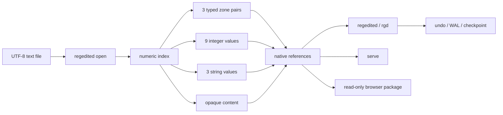

### So I rewrote the Windows Registry in Rust.

What makes `regedit` so great? This started as a joke: "Why need a DB? You should dangerously grep a million-line markdown file."

# Regedited

> The best way to predict the future is to invent it.
>
> Alan Kay

**The registry, edited.**

> A fast plaintext parse-ment database with numeric indexes, typed hex-word ranges, native references, guarded zone relocation, clipboard transport, and an optional HTTP or browser runtime.

### "Turn any file into a registry"

Regedited finds the literal phrase `regedited open` anywhere in a line. The structured lines immediately below it define a numeric index without changing the rest of the file into a proprietary format.

The source can be Markdown, HTML, JavaScript, F#, CSS, a shell script, or any other UTF-8 text file. Regedited does not assign meaning to the surrounding syntax. It indexes only the small structure you explicitly give it.

```text
anything before this is ignored: regedited open :anything after it is ignored
index: 64
1x0000055 : 1x000005F : 0x0000000 : 0x0000000 : 0x0000000 : 0x0000000
15 | 0 | 0 | 0 | 0 | 0 | 0 | 0 | 0
Primary summary
Secondary summary
One important line
---
...ordinary file content continues...
```

Index `64` now has:

- three typed line ranges;
- nine signed decimal values;
- three string values;
- an opaque content region after `---`;
- one canonical numeric identity, regardless of where the opener lives.

## Why It Is Fast

The scan and search path memory-maps the file, walks borrowed UTF-8 slices, and builds compact metadata for each index. It does not deserialize a SQL database or construct an object for every content line.

| Operation | What Regedited reads |
|---|---|
| `scan`, `fgrep`, metadata diff | Memory-mapped file and indexed metadata lines |
| Indexed string or DB lookup | The selected index metadata |
| Zone extraction | The line range stored in one zone pair |
| Mutating commands | The UTF-8 document, then a guarded rewrite |
| `check` / `commit` | Compact fingerprints and surrounding line anchors |

This is inspired by [safetensors](https://github.com/huggingface/safetensors): keep addresses small, make identity explicit, and avoid pretending the payload needs a heavyweight schema.

The repository includes an ignored stress test that relocates a zone in a one-million-line document while keeping the checkpoint compact:

```bash
cargo test million_line_relocation_keeps_checkpoint_compact --lib -- --ignored
```

## Quick Start

### 1. Build

```bash
cargo build --release
```

Windows requires the Rust MSVC toolchain and Visual Studio Build Tools with **Desktop development with C++**. See [the Rust beginner setup](./docs/shell/RUST_BEGINNER_SETUP.txt) for the full first-machine walkthrough.

### 2. Add both command names to PATH

`regedited` and `rgd` are the same compiled executable. The helper creates `rgd` as a hard link on Windows or a symlink on Linux, then adds `target/release` to the user PATH.

```powershell
# Windows PowerShell
.\scripts\pathadd.ps1
```

```bash
# Linux / Bash
bash ./scripts/pathadd.sh
source ~/.bashrc
```

### 3. Create and load a document

```bash
regedited new notes.md "Indexed notes"
regedited add notes.md 64

rgd load notes.md
rgd l
rgd db i64
rgd ist 64
```

`regedited` is the explicit, stateless command surface. `rgd` adds aliases, compact references, and an optional remembered file path. An explicit path always wins.

```bash
rgd load notes.md   # remember a document
rgd load            # print the remembered document
rgd unload          # clear it
```

### 4. Ask the executable

The help tables are generated from the actual Clap command definitions and alias registry.

```bash
rgd --help           # categorized syntax table
rgd --help -e        # same table, advanced examples
rgd rb -help         # one command in detail

regedited -ex powershell
regedited -ex script powershell
```

## Canonical Indexes

The numeric value on the line after an opener is the identity. These references all resolve index 64:

```text
64
i64
index:64
```

Duplicate numeric indexes are rejected, including duplicates hidden behind two different legacy section labels.

<details>
<summary><strong>Legacy <code>## SECTION:</code> compatibility</strong></summary>

Older files may use a human-readable opener:

```markdown
## SECTION: CustomerNotes
index: 64
0x0000000 : 0x0000000 : 0x0000000 : 0x0000000 : 0x0000000 : 0x0000000
1 | 2 | 3 | 4 | 5 | 6 | 7 | 8 | 9
First string
Second string
Third string
---
Content
```

`CustomerNotes` remains a compatibility alias, but `64` is canonical. New indexes created with `regedited add` use `regedited open` and do not invent a section name.

</details>

## Document Layout

| Relative line | Field | Meaning |
|---:|---|---|
| `+0` | Any line containing `regedited open` | Canonical opener; text around the phrase is ignored |
| `+1` | `index: N` | Numeric identity |
| `+2` | Six hex-words | Three typed `(start, end)` zone pairs |
| `+3` | Nine integers | Pipe-separated DB values; legacy tab separators are accepted |
| `+4..+6` | Three strings | Summaries, labels, or arbitrary one-line values |
| `+7` | `---` | Metadata/content separator |
| `+8..` | Content | Ordinary UTF-8 content until the next index or EOF |

The trigger is an exact lowercase byte match for `regedited open`. It may appear inside a comment or arbitrary text, but text before and after the phrase is never parsed as a name.

```html
<!-- application metadata: regedited open :do not parse this suffix
index: 500
0x0000000 : 0x0000000 : 0x0000000 : 0x0000000 : 0x0000000 : 0x0000000
0 | 0 | 0 | 0 | 0 | 0 | 0 | 0 | 0
HTML index


---
-->
```

## Hex-Words and Zones

Each line pointer is `TxLLLLLLL`:

- `T` is one type nibble;
- `x` is the literal separator;
- `LLLLLLL` is a seven-digit hexadecimal line number;
- line numbers are zero-based and inclusive;
- the maximum line address is `0x0FFFFFFF` (`268,435,455`).

| Prefix | Inline token | Type | Example |
|---:|---|---|---|
| `0` | `p` | Markdown / plain text | `0x0000055` |
| `1` | `b` | Code / block | `1x0000055` |
| `2` | `m` | Media | `2x0000055` |
| `3` | `d` | Database | `3x0000055` |
| `4-F` | - | Reserved | Not currently assigned |

The six values form three pairs:

```text
zone 1 start : zone 1 end : zone 2 start : zone 2 end : zone 3 start : zone 3 end
```

### Assign lines directly to a zone

With a loaded `rgd` document:

```bash
rgd cv b 85 95 to i64 1
```

That converts lines 85-95 to code hex-words and writes them into zone 1 on index 64:

```text
1x0000055 : 1x000005F
```

The explicit equivalent is:

```bash
regedited index-zone-set-lines notes.md 64 1 b 85 95
```

Add `clip` or `c` before `to` to copy the generated pair after writing it:

```bash
rgd cv b 85 95 clip to i64 1
```

> **Zone numbering:** Native refs and `index-zone-set-lines` / `index-zone-set-hex` use human-facing zones `1-3`. Older direct commands such as `zone-extract`, `zone-replace`, `set-zone`, `grep`, and `clip-zone` retain their original zero-based zones `0-2`. Command help always states which convention applies.

<details>
<summary><strong>Converter grammar</strong></summary>

`convert` accepts one to six line numbers, inline type changes, and an optional clipboard suffix.

```bash
rgd cv 58
rgd cv 58 59
rgd cv 58 59 80 90 300 325
rgd cv d 58 59
rgd cv d 58 p 59
rgd cv b 85 95 c
```

It prints only the values requested; it does not pad the result with empty ranges.

</details>

## Native References

References give one grammar to strings, DB values, full metadata lines, defined zones, and literal ranges.

| Canonical reference | `rgd` compact form | Resolves to |
|---|---|---|
| `index:64:string:2` | `i64s2` | String 2 |
| `index:64:db:7` | `i64db7` | DB value 7 |
| `index:64:dbline` | `i64dbl` | All nine DB values |
| `index:64:hexline` | `i64hl` | All six hex-words |
| `index:64:zone:1` | `i64z1` or `i64r1` | Defined zone 1 content |
| `index:64:zonehex:1` | `i64zh1` or `i64rh1` | Defined zone 1 hex pair |
| `hex:1x0000055..1x000005F` | - | Literal line range |
| `text:hello` | - | Literal string |

```bash
# Read and copy
rgd rg i64s2
rgd rg i64z1 c

# Set and transfer
rgd rs i64s2 --text "follow up Friday"
rgd rc i64z1 i70z2
rgd rc i64s1 i70s2 --append

# Diff and boolean comparison
rgd rd i64db1 i70db2
rgd rb i64db7 gte 8 --then-val READY --else-val WAIT
rgd rb i64z1 contains waterfront
```

`ref-bool` supports `contains`, `eq`, `ne`, `gt`, `gte`, `lt`, and `lte`. Numeric comparisons parse both sides as `f64`; malformed numeric input is an error, not a false result.

<details>
<summary><strong>Reference write behavior</strong></summary>

- `ref-get` prints the resolved value or copies it with `--clip`.
- `ref-set` accepts `--text`, `--from <REF>`, or stdin.
- `ref-copy` can replace, append, or move with `--move`.
- String, DB, DB-line, hex-line, zone, zone-hex, and literal-range targets have type-specific validation.
- Range moves reject overlapping literal destinations.
- Mutating ref commands create the same one-step undo protection as other writes.

</details>

## Guarded Zone Relocation

The checkpoint workflow is for the common case where content above a defined zone changes and its literal hex-word pair has not been manually edited.

```bash
rgd load notes.md

rgd cm          # create the first checkpoint
# edit the document normally
rgd ck          # calculate a guarded temporary relocation diff
rgd pl          # apply safe relocations

# Or check and pull in one command:
rgd cm --pull
```

Regedited stores compact content fingerprints and nearby line anchors, not a document history. It refuses to guess when:

- an index disappeared or became ambiguous;
- the literal hex-word pair changed after the checkpoint;
- the old content has multiple plausible new locations;
- content changed in place rather than moving cleanly.

| Artifact | Location | Purpose |
|---|---|---|
| Checkpoint | `<document>.rgd-state.json` | One current compact checkpoint |
| Pending diff | OS temp directory under `regedited/zone-diffs` | Guarded relocation proposal |
| Undo | `<document>.undo` | One-step restoration for writes |
| WAL | Document-adjacent WAL files | Crash-recovery state for WAL operations |

There is no commit history. A new checkpoint replaces the old checkpoint after safe work is accepted.

## Command Map

The executable is the authoritative command reference:

```bash
rgd --help
rgd --help -e
<command> -help
```

<details>
<summary><strong>Indexes and document inspection</strong></summary>

| Command | `rgd` | Purpose |
|---|---:|---|
| `list` | `l` | List numeric indexes |
| `db` | `db` | Print one index's nine DB values |
| `hexline` | `hl` | Print the six hex-words; `ascii` is a legacy alias |
| `scan` | `s` | Scan and filter index metadata |
| `resolve-index` | `ri` | Resolve a numeric index to its internal layout key |
| `index-str-list` | `ist` | Print all three string values |
| `content` | `co` | Print content after the index separator |
| `new`, `add`, `rm` | `n`, `a`, `rm` | Create a file, add a numeric index, or remove one |
| `summary`, `info` | `sm`, `i` | Print document-level information |

</details>

<details>
<summary><strong>Values, ranges, search, and clipboard</strong></summary>

| Family | Commands |
|---|---|
| Native refs | `ref-get`, `ref-set`, `ref-copy`, `ref-diff`, `ref-bool` |
| Direct values | `set-num`, `set-str`, `set-zone` |
| Zone content | `zone-copy`, `zone-append`, `zone-replace`, `zone-extract`, `zone-info` |
| Numeric index zones | `index-zone-extract`, `index-zone-replace`, `index-zone-copy`, `index-zone-transfer`, `index-zone-set-hex`, `index-zone-set-lines` |
| Literal ranges | `hex-extract`, `hex-replace`, `lines`, `convert`, `types` |
| Search | `fgrep`, `fgrep-multi`, `grep` |
| Boolean content | `bool-and`, `bool-nand`, `bool-or`, `bool-xor`, `count`, `if-contains` |
| Clipboard / output | `clip`, `echo`, `echo-direct`, `clip-zone`, `clip-db`, `clip-dbline`, `clip-hexline`, `clip-hexword` |

`fgrep --index i64` is canonical. The old `--section` spelling remains a visible compatibility alias.

</details>

<details>
<summary><strong>Safety, structure, and runtime</strong></summary>

| Family | Commands |
|---|---|
| Metadata comparison | `diff`, `replace` |
| Native state | `state`, `state-compare` |
| Zone checkpoint | `check`, `commit`, `pull` |
| Recovery | `undo`, `wal`, `wal-replay` |
| Transactions | `tx begin`, `tx commit`, `tx rollback`, `tx status` |
| Schemas and typed values | `schema`, `reg-types`, `reg-parse` |
| Text utilities | `getutf`, `encap`, `grab-html` |
| HTTP | `serve` |

</details>

## HTTP Registry Container

```bash
regedited serve --file notes.md --port 5000
```

The current native server binds `0.0.0.0:<port>` and serves the document loaded at startup. Read-only mode is the default.

<details>
<summary><strong>HTTP endpoints</strong></summary>

The `/sections` and `/section/...` route names are retained for compatibility; their identity is numeric-index-first.

| Method | Route | Purpose |
|---|---|---|
| `GET` | `/` | Status and index list |
| `GET` | `/sections` | All indexes |
| `GET` | `/section/{index}` | Index metadata |
| `GET` | `/section/{index}/db` | Nine DB values |
| `GET` | `/section/{index}/hexline` | Six hex-words |
| `GET` | `/section/{index}/ascii` | Legacy alias for `/hexline` |
| `GET` | `/section/{index}/zone/{0-2}` | Direct zero-based zone content |
| `GET` | `/grep?pattern=P&index=N` | Search one index; `section=` is accepted as an alias |
| `GET` | `/state` | Native state JSON |
| `GET` | `/ref?spec=SPEC` | Resolve a native reference |
| `GET` | `/ref-bool?left=A&op=OP&right=B` | Boolean ref comparison |
| `GET` | `/types` | Zone types |
| `GET` | `/wal` | WAL status |
| `GET` | `/health` | Health response |
| `POST` | `/query` | Boolean query JSON |

```bash
curl http://127.0.0.1:5000/sections
curl http://127.0.0.1:5000/section/64/db
curl "http://127.0.0.1:5000/grep?pattern=waterfront&index=64"
curl "http://127.0.0.1:5000/ref?spec=index:64:string:2"
curl "http://127.0.0.1:5000/ref-bool?left=index:64:db:7&op=gte&right=8"
```

</details>

## Browser / Wasm Package

The optional browser build is read-only. It accepts a string containing the document and exposes scanning, grep, index reads, compact refs, and conversion without requiring a server.

```powershell
# Windows
.\scripts\webbuild.ps1
```

```bash
# Linux
bash ./scripts/webbuild.sh
```

The scripts verify Rust, `wasm32-unknown-unknown`, and `wasm-pack`, ask before installing missing tooling, and write the package to `web/pkg`.

<details>
<summary><strong>Minimal JavaScript usage</strong></summary>

```javascript
import { createRegeditedRunner } from "./pkg/runner.js";

const source = await fetch("./notes.md").then((response) => response.text());
const rgd = await createRegeditedRunner(source);

console.log(rgd.list());
console.log(rgd.readIndex(64));
console.log(rgd.refGet("i64s2"));
console.log(rgd.grep("waterfront", "i64"));
console.log(rgd.convert([85, 95], "code"));
```

The browser runner intentionally rejects mutating CLI commands. See [JavaScript API help](./docs/web/JAVASCRIPT.txt) and [standalone HTML help](./docs/web/STANDALONE_HTML.txt).

</details>

## Architecture



The scanner keeps an internal layout key because legacy headers still exist, but all current CLI identity and replacement logic joins records by numeric index. Numeric references resolve before legacy names.

<details>
<summary><strong>Source map</strong></summary>

| Path | Responsibility |
|---|---|
| [`src/header.rs`](./src/header.rs) | Trigger scanning, numeric index resolution, metadata line locations |
| [`src/fast_ops.rs`](./src/fast_ops.rs) | Memory-mapped scan, grep, diff, and numeric-index replacement |
| [`src/store.rs`](./src/store.rs) | High-level read/write API and one-step backups |
| [`src/zone_type.rs`](./src/zone_type.rs) | Hex-word codec and zone types |
| [`src/zone_editor.rs`](./src/zone_editor.rs) | Zone extraction, replacement, copying, and line-delta updates |
| [`src/zone_checkpoint.rs`](./src/zone_checkpoint.rs) | Compact checkpoint, guarded diff, and relocation pull |
| [`src/qol.rs`](./src/qol.rs) | `rgd` aliases, loaded path, compact refs, natural assignment grammar |
| [`src/main.rs`](./src/main.rs) | Clap CLI, native refs, help tables, state, and command routing |
| [`src/serve.rs`](./src/serve.rs) | Native HTTP registry container |
| [`web/src/lib.rs`](./web/src/lib.rs) | Wasm bindings |
| [`web/runner.js`](./web/runner.js) | CLI-shaped browser facade |

See [Architecture](./docs/ARCHITECTURE.md) and [Flowcharts](./docs/FLOWCHART.md) for the extended internals.

</details>

## Development

```bash
cargo fmt --all -- --check
cargo test --all-targets
cargo clippy --all-targets -- -D warnings
cargo build --release
```

The CLI integration tests create a real `rgd` hard link and exercise loaded paths, compact refs, numeric index compatibility, checkpoint relocation, and line-to-zone assignment.

<details>
<summary><strong>Documentation index</strong></summary>

- [Quick Start](./QUICK_START.md)
- [Changelog](./CHANGELOG.md)
- [Architecture](./docs/ARCHITECTURE.md)
- [Flowcharts](./docs/FLOWCHART.md)
- [Python integration](./docs/PYTHON.md)
- [PowerShell commands](./docs/shell/POWERSHELL.txt)
- [Bash commands](./docs/shell/BASH.txt)
- [Python subprocess commands](./docs/shell/PYTHON.txt)
- [REPL commands](./docs/shell/REPL.txt)
- [Batch commands](./docs/shell/BAT.txt)
- [JavaScript API](./docs/web/JAVASCRIPT.txt)
- [Standalone HTML](./docs/web/STANDALONE_HTML.txt)
- [Contributing](./CONTRIBUTING.md)

</details>

## Design Boundaries

Regedited is deliberately small and explicit:

- Input must be valid UTF-8.
- An index has exactly three zone pairs, nine signed integer values, and three string lines.
- Zone pointers are physical zero-based line numbers, not AST nodes.
- The canonical opener is the exact lowercase phrase `regedited open`.
- `rgd load` stores local convenience state; canonical `regedited` does not.
- The browser package is read-only.
- The native HTTP server binds all interfaces by design; network access control belongs to the host environment.
- Checkpoints relocate unchanged zone content. They do not create version history.

That is the point: one readable file, one small binary, no SQL server, and no hidden document model.

## License

Regedited is licensed under the [GNU Affero General Public License v3.0](./LICENSE).
