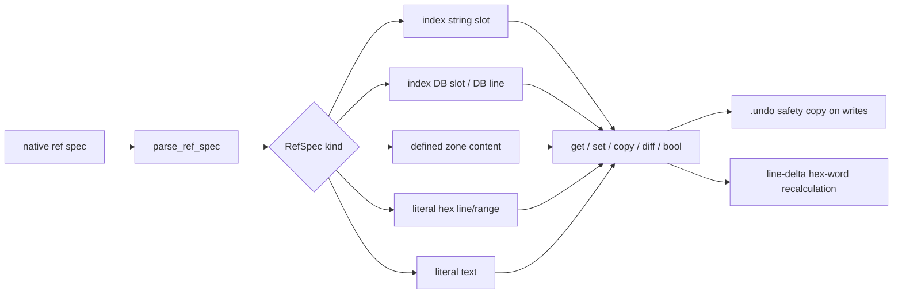
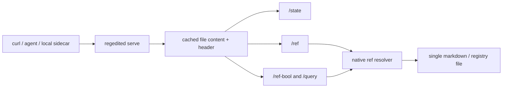

# Architecture

How Regedited works internally — from memory layout to hex-word encoding.

## Table of Contents

- [Why It's Fast](#why-its-fast)
- [Design Goals](#design-goals)
- [Module Overview](#module-overview)
- [Data Flow](#data-flow)
- [Key Types](#key-types)
- [Hex-Word Format Deep-Dive](#hex-word-format-deep-dive)
- [Native Ref Specs](#native-ref-specs)
- [Document Format Specification](#document-format-specification)
- [Command Reference](#command-reference)
- [Serve Runtime Ref Endpoints](#serve-runtime-ref-endpoints)
- [Python Integration](#python-integration)
- [Memory Layout](#memory-layout)
- [Performance Characteristics](#performance-characteristics)
- [Error Handling](#error-handling)
- [Windows Compatibility](#windows-compatibility)
- [Testing](#testing)

---

## Why It's Fast

Regedited treats a plaintext markdown file like a **memory-mapped key-value store**. Instead of reading the entire file into RAM, it:

1. **Memory-maps the file** via `memmap2` — the OS handles paging, only accessed pages touch RAM
2. **Scans index openers** — a single pass finds canonical `"regedited open"` triggers and compatible `## SECTION:` markers
3. **Builds an index** — a `BTreeMap<String, SectionInfo>` gives O(log n) section lookups
4. **Jumps directly to content** — byte offsets in `SectionInfo` enable O(1) zone extraction
5. **Patches with line deltas** — content-aware zone manipulation recalculates only affected hex-words
6. **Resolves native refs** — `index:N:string:M`, `index:N:zone:M`, and `hex:A..B` specs address data without a SQL schema

The result: a **10GB file with 1,000 sections uses ~200KB of Rust heap**. The file itself lives in OS-managed virtual memory.

### Comparison

| Approach | 10GB File RAM | Startup | Section Jump |
|----------|--------------|---------|--------------|
| `cat + grep` | 10GB | O(n) | O(n) scan |
| `ripgrep` | streaming | O(n) | O(n) scan |
| Python readlines() | 10GB | O(n) | O(1) index |
| **Regedited** | **~200KB** | **O(index openers)** | **O(1) byte offset** |

The Python readlines() approach loads everything into a Vec, giving O(1) jumps — but at the cost of 10GB RAM. Regedited gets the same O(1) jumps with 50,000x less memory.

---

## Design Goals

1. **Safetensors-style speed**: Header-only operations, memory-mapped I/O
2. **Human-readable format**: Plain markdown with hex-word annotations
3. **Python-scriptable**: Clean stdout, subprocess-friendly
4. **Windows-compatible**: Safe echo, clipboard support
5. **Multi-GB capable**: O(1) section jumps, no full-file buffering

---

## Module Overview

```
src/
├── main.rs              # CLI router: 60+ commands via clap
├── lib.rs               # Core types, re-exports, 21 public modules
│
├── CORE ENGINE
├── fast_ops.rs          # Scan, diff, replace, grep — safetensors-style header-only ops
├── header.rs            # Canonical "regedited open" trigger parser + ## SECTION compatibility
│                        # Zero-allocation exact byte search
├── zone.rs              # Zone extraction with type-prefixed content
├── zone_editor.rs       # Content-aware zone copy/append/replace with LineDelta recalculation
├── store.rs             # High-level Store API with section caching
├── ascii_store.rs       # Legacy module name for the hex-word line: 6 typed zone pairs
├── db_line.rs           # 9-value database + 3-string parser (pipe \| or tab, auto-detect)
├── zone_type.rs         # ZoneType enum (Markdown/Code/Media/Database) + hex-word codec
│
├── WINDOWS-NATIVE
├── echo.rs              # Windows CMD safe echo: 5 strategies for special characters
├── clip.rs              # Cross-platform clipboard: 6 commands (arboard crate)
├── utf16.rs             # getutf() DWORD-style line number encoding/decoding
│
├── encapsulate.rs       # Three-mode encapsulation: b=["..."] c=['...'] d=["'...'"]
├── html_extract.rs      # HTML attribute extraction: GRAB B/C/D equivalent
├── bool_ops.rs          # Boolean AND/NAND/OR/XOR + count + if-then-else
│
├── SERIOUS CONFIGURATION SUBSTRATE
├── wal.rs               # Write-ahead log: CRC32 checksummed, fsync'd, crash recovery
├── transaction.rs       # Begin/commit/rollback: all-or-nothing batch atomicity
├── schema.rs            # Optional per-section type enforcement (string/int/bool/path/enum/array)
├── typed_value.rs       # 10 registry types: REG_SZ/DWORD/QWORD/BINARY/MULTI_SZ/EXPAND_SZ/JSON/TOML/BOOL
└── serve.rs             # HTTP container: sections, grep, state, refs, boolean queries

docs/
├── ARCHITECTURE.md        # Full internals: data flow, memory layout, hex-word deep-dive
├── FLOWCHART.md           # 7 mermaid diagrams (module deps, CLI router, Python integration)
└── shell/                 # Command Reference Sheet (per-Shell)
    ├──powershell.txt
    ├──python.txt
    └──bash.txt
```
---

## Data Flow

### Reading

```
File → MmapFile (zero-copy) → scan_content() → DocumentHeader
                                                    ↓
                                            SectionInfo (offsets)
                                                    ↓
                                    extract_zone() → Zone (content + metadata)
```

1. `MmapFile::open()` memory-maps the file
2. `scan_content()` finds all canonical `"regedited open"` triggers and compatible `## SECTION:` headers in one pass
3. `DocumentHeader` stores `SectionInfo` with line numbers and byte offsets
4. `extract_zone()` uses byte offsets for O(1) jumps to content

### Writing

```
Changes → Store.update_*() → content string manipulation
                                    ↓
                          update_lines() (batched line replacement)
                                    ↓
                          apply_line_deltas() (recalculate hex-words)
                                    ↓
                          fs::write() (atomic file replace)
```

1. `Store` caches section data to avoid repeated parsing
2. Changes are batched and applied via `update_lines()`
3. If content size changes, `apply_line_deltas()` shifts all subsequent line numbers
4. File is written atomically (no partial writes visible to readers)

### Native Ref Resolution

```
Ref string → parse_ref_spec() → RefSpec enum
                                  ↓
                          read_ref_value()
                                  ↓
        index lookup / DB slot / string slot / zone range / hex range
                                  ↓
          ref-get | ref-set | ref-copy | ref-diff | ref-bool
```

Native refs are the command router for database-like behavior. They let one resolver handle all addressable storage shapes:

- Section strings: `index:3:string:2`
- Numeric DB cells: `index:3:db:8`
- Full DB lines: `index:3:dbline`
- Hex-word lines: `index:3:hexline` (`index:3:ascii` remains a legacy alias)
- Defined content ranges: `index:3:zone:1`
- Defined hex-word ranges: `index:3:zonehex:1`
- Literal line ranges: `hex:0x0000020..0x0000028`
- Literal values: `text:literal value`

Writes pass through `write_file_with_undo()` for a one-step `.undo` copy, then use the same line-delta recalculation as zone replacement when content length changes.



### Zone Content Manipulation

```
Source zone → extract_zone_content() → content string
                                              ↓
Target zone → replace_zone_content() ← new content
                                              ↓
                                calculate delta (new_lines - old_lines)
                                              ↓
                                apply_line_deltas() to entire document
                                              ↓
                                all hex-word lines updated
```

When a zone's content grows or shrinks:
1. The content is spliced in at the correct line range
2. A `LineDelta` is calculated: `(new_line_count - old_line_count)`
3. `apply_line_deltas()` scans all sections and shifts hex-word line numbers
4. Every zone boundary stays consistent with the new document structure

---

## Key Types

### DocumentHeader

```rust
pub struct DocumentHeader {
    pub sections: BTreeMap<String, SectionInfo>,
    pub total_lines: usize,
    pub total_bytes: usize,
}
```

The `BTreeMap` keeps sections in name order. Lookups are O(log n). Each `SectionInfo` contains pre-computed line numbers for every line in the section's metadata block.

### SectionInfo

```rust
pub struct SectionInfo {
    pub name: String,
    pub header_line: usize,       // canonical regedited open trigger or legacy ## SECTION: Name
    pub index_line: usize,        // 123
    pub ascii_line: usize,        // hex-word line
    pub numeric_line: usize,      // 1 2 3 4 5...
    pub string1_line: usize,      // "first string"
    pub string2_line: usize,      // "second string"
    pub string3_line: usize,      // "third string"
    pub separator_line: usize,    // ---
    pub content_start: usize,     // first content line
    pub content_end: usize,       // last content line
}
```

All line numbers are pre-computed during the scan phase. No re-scanning needed for O(1) access to any line.

### Hex-Word Line (`AsciiStore` Legacy Type)

```rust
pub struct AsciiStore {
    pub zones: [ZonePair; 3],
}

pub struct ZonePair {
    pub start: u32,           // 28-bit line number
    pub end: u32,             // 28-bit line number
    pub zone_type: ZoneType,  // Markdown, Code, Media, Database
}
```

The public Rust type is still named `AsciiStore` for compatibility, but the concept is the hex-word line: six typed hex-words representing three zone pairs. The hex-word format `TxLLLLLLL` packs type and line number into a u32. This is parsed via bit masking, not string parsing, for speed.

16GB per registry storefile

### DbLine

```rust
pub struct DbLine {
    pub numbers: [i64; 9],
    pub strings: [String; 3],
}
```

Simple fixed-size arrays. Parsed via `split('\t')` — no complex parsing needed.

---

## Hex-Word Format Deep-Dive

Each zone boundary is a single 32-bit value: `TxLLLLLLL`

### Bit Layout

```
31  28 27                                                   0
+------+----------------------------------------------------+
| Type |              Line Number (28 bits)                |
+------+----------------------------------------------------+
```

| Field | Bits | Range | Description |
|-------|------|-------|-------------|
| `T` | 4 | 0-15 | Type nibble |
| `L` | 28 | 0-268,435,455 | Line number |

### Type Nibbles

| Nibble | Name | Description |
|--------|------|-------------|
| `0x0` | Markdown | Plain text content (default) |
| `0x1` | Code | Code snippets, scripts, shell commands |
| `0x2` | Media | Images, audio, video references |
| `0x3` | Database | Tabular data, structured content |
| `0x4-F` | Custom/Reserved | Domain-specific lanes for future tooling |

The category is intentionally visible at the first character of the hex-word. `0x...` reads as prose, `1x...` reads as code, `2x...` reads as media, and `3x...` reads as structured database content. This makes a single markdown, HTML, JS, or misc text file behave like a small database management surface while still remaining readable in Obsidian, VS Code, or any plain editor.

In practice:

- **Markdown/Text (`0`)**: notes, documentation, CRM communication history, templates.
- **Code (`1`)**: scripts, shell commands, source snippets, generated config blocks.
- **Media (`2`)**: image references, audio/video references, asset manifests.
- **Database (`3`)**: generated tables, machine-owned summaries, structured blocks.
- **Custom (`4-F`)**: reserved for domain-specific overlays once a project needs them.

### Zone Pair Encoding

Three pairs of `(start, end)` define content boundaries:

```
0x0000000 : 0x0000000 : 1x000003C : 1x0000042 : 0x0000000 : 0x0000000
 \_________/   \_________/   \_________/   \_________/
  Zone 0       (empty)       Zone 1       (Code)      Zone 2 (empty)
```

| Position | Meaning |
|----------|---------|
| Words 0-1 | Zone 0: `(start_0, end_0)` |
| Words 2-3 | Zone 1: `(start_1, end_1)` |
| Words 4-5 | Zone 2: `(start_2, end_2)` |

Both start and end are **inclusive** line numbers (0-indexed into the file). An empty zone is `0x0000000 : 0x0000000`.

### Examples

| Hex-Word | Type | Line | Meaning |
|----------|------|------|---------|
| `0x000000A` | Markdown | 10 | Plain text at line 10 |
| `1x0000050` | Code | 80 | Code block at line 80 |
| `2x0000A00` | Media | 2560 | Media reference at line 2560 |
| `3x0000001` | Database | 1 | Database content at line 1 |
| `0xFFFFFFF` | Markdown | 268,435,455 | Max line number |

### Decoding (Rust pseudo-code)

```rust
fn decode_hex_word(hex_word: u32) -> (ZoneType, u32) {
    let type_nibble = (hex_word >> 28) as u8;
    let line_number = hex_word & 0xFFFFFFF;
    (ZoneType::from_nibble(type_nibble), line_number)
}
```

No string parsing — pure bit masking. This is why zone lookups are O(1).

---

## Native Ref Specs

Native refs are typed addresses for values inside the plaintext file. They keep commands intuitive by avoiding separate command families for every data shape.

| Spec | Reads/Writes |
|------|--------------|
| `index:<n>:string:<1-3>` | One of the three string slots |
| `index:<n>:db:<1-9>` | One numeric DB value |
| `index:<n>:dbline` | The complete 9-value DB line |
| `index:<n>:hexline` | The complete six-word hex-word line |
| `index:<n>:ascii` | Legacy alias for `index:<n>:hexline` |
| `index:<n>:zone:<1-3>` | Defined zone content |
| `index:<n>:zonehex:<1-3>` | Defined zone as `start : end` hex-words |
| `hex:<word>` | One literal line by hex-word |
| `hex:<start>..<end>` | Literal line range by hex-word |
| `text:<literal>` | Literal text value, read-only as a source |

All user-facing slots are 1-based. Internally, Rust arrays remain 0-based.

### Ref Commands

```bash
regedited ref-get doc.md index:3:string:1
regedited ref-get doc.md index:3:zone:2 --clip
regedited ref-set doc.md index:3:db:8 --text 25
regedited ref-copy doc.md index:3:zone:1 index:4:zone:2
regedited ref-copy doc.md index:3:zone:1 index:4:zone:2 --move
regedited ref-diff doc.md index:3:zone:1 hex:0x0000020..0x0000028
regedited ref-bool doc.md index:3:zone:1 contains waterfront
regedited ref-bool doc.md index:3:db:8 gte 10 --then-val HOT --else-val HOLD
```

### State and Undo

`state` emits a JSON snapshot containing section names, indexes, hex-word lines, DB values, strings, zone lengths, and checksums. `state-compare` compares a later file against that JSON. This is not a history engine; it is a fast truth snapshot for automation.

Write commands that route through native refs create one safety copy at `<file>.undo`. `undo <file>` restores that copy. The intent is simple recovery, not long-term version history.

```bash
regedited state doc.md > before.json
regedited ref-set doc.md index:3:string:2 --text "new value"
regedited state-compare doc.md before.json
regedited undo doc.md
```

---

## Document Format Specification

Each section follows a strict structure:

```markdown
<!-- anything regedited open anything -->
<Index>
<Hex-Word Line>
<Database Line>
<String 1>
<String 2>
<String 3>
---
<Markdown Content>
```

### Complete Example

```markdown
<!-- arbitrary wrapper regedited open arbitrary suffix -->
index: 200
0x0000000 : 0x0000000 : 1x000003C : 1x0000042 : 0x0000000 : 0x0000000
42 | 7 | 3 | 256 | 1024 | 4096 | 100 | 200 | 300
main.rs core logic
utility functions
database connection code
---
## Main Logic

```rust
fn main() {
    println!("Hello from Regedited!");
}
```
```

### Line Layout

| Offset from Header | Content | Example | Notes |
|--------------------|---------|---------|-------|
| +0 | any line containing `regedited open` | `<!-- arbitrary wrapper regedited open arbitrary suffix -->` | Canonical index opener; surrounding text ignored; `index: <N>` is the address. `## SECTION:` also accepted |
| +1 | `index: <N>` | `index: 200` | Human-readable index |
| +2 | Hex-Word Line | `0x0000000 : ...` | 6 hex-words, colon-separated |
| +3 | Database Line | `42 \| 7 \| 3 \| ...` | 9 values, pipe-separated (Obsidian-friendly) |
| +4 | String 1 | `main.rs core logic` | Description/label |
| +5 | String 2 | `utility functions` | Notes |
| +6 | String 3 | `database connection code` | Reference |
| +7 | Separator | `---` | Content boundary |
| +8 | Content Start | Markdown content begins | Opaque to Regedited |

### Content Area

Standard markdown. Content is opaque to Regedited — it is not parsed. Zones point into this area by line number.

### Multi-GB File Considerations

For files larger than available RAM:

1. **Memory mapping**: Files are accessed via `memmap2` for zero-copy reads
2. **Header scan only**: `scan` reads ~100 bytes per section header, not the full file
3. **Line offsets**: The scanner builds an index of `(line_number, byte_offset)` pairs
4. **Zone extraction**: Uses byte offsets for O(1) jumps to any line
5. **No full-file buffering**: Content is sliced from the mmap, never copied

The 28-bit line number limit (268,435,455 lines) supports files up to roughly 50-100GB with average line lengths of 50-100 bytes.

---

## Command Reference

### Document Inspection

| Command | Args | Description |
|---------|------|-------------|
| `list` | `<file>` | List all sections |
| `scan` | `<file> [--filter <pat>] [--value <i:min:max>]` | Header-only scan |
| `db` | `<file> <section>` | Show database table |
| `hexline` | `<file> <section>` | Show hex-word line |
| `ascii` | `<file> <section>` | Legacy alias for `hexline` |
| `info` | `<file>` | Full document info |
| `summary` | `<file>` | Document summary |
| `content` | `<file> <section>` | Section markdown content |

### Grep & Extract

| Command | Args | Description |
|---------|------|-------------|
| `fgrep` | `<file> <pattern> [-s <section>]` | Memory-mapped grep |
| `fgrep-multi` | `<file> <p1> <p2>...` | Multi-pattern OR grep |
| `grep` | `<file> <section> <zone>` | Extract zone by index |
| `zone-extract` | `<file> <section> <zone>` | Raw zone to stdout |
| `zone-info` | `<file> <section> <zone>` | Machine-readable zone meta |
| `lines` | `<file> <start> <end>` | Arbitrary line range |

### Zone Manipulation

| Command | Args | Description |
|---------|------|-------------|
| `zone-copy` | `<file> -f <S> -m <n> -t <T> -n <n>` | Copy zone content |
| `zone-append` | `<file> <S> <z> [--text <t>]` | Append to zone (or stdin) |
| `zone-replace` | `<file> <S> <z> [--text <t>]` | Replace zone (or stdin) |

### Boolean Operations

| Command | Args | Exit 0 when |
|---------|------|-------------|
| `bool-and` | `<file> <S> <p1> [p2]...` | ALL patterns found |
| `bool-nand` | `<file> <S> <must> <mustnot>` | Contains must, NOT mustnot |
| `bool-or` | `<file> <S> <p1> [p2]...` | ANY pattern found |
| `bool-xor` | `<file> <S> <a> <b>` | Exactly ONE found |
| `count` | `<file> <S> <pattern>` | Always 0 (shows count) |
| `if-contains` | `<file> <S> <p> [--then <v>] [--else <v>]` | Always 0 (prints value) |

### Native Ref Operations

| Command | Args | Description |
|---------|------|-------------|
| `ref-get` | `<file> <spec> [--clip]` | Read any native ref spec |
| `ref-set` | `<file> <target> [--from <spec>] [--text <t>] [--append]` | Write literal/stdin/resolved ref to a target |
| `ref-copy` | `<file> <from> <to> [--append] [--move]` | Copy or move one ref into another |
| `ref-diff` | `<file> <left> <right>` | Print a small line diff between two refs |
| `ref-bool` | `<file> <left> <op> <right> [--then-val <v>] [--else-val <v>]` | Compare refs/literals with `contains`, `eq`, `ne`, `gt`, `gte`, `lt`, `lte` |
| `index-str-list` | `<file> <index>` | Print string slots 1-3 for a registry index |
| `index-zone-set-hex` | `<file> <index> <zone> <start> <end>` | Set a defined zone's stored hex-word pair |

### Write

| Command | Args | Description |
|---------|------|-------------|
| `set-num` | `<file> <S> <i> <v>` | Update numeric value (0-8) |
| `set-str` | `<file> <S> <i> <v>` | Update string (0-2) |
| `set-zone` | `<file> <S> <z> <s> <e> [-t <type>]` | Update zone range+type |
| `add` | `<file> <section>` | Add new section |
| `rm` | `<file> <section>` | Remove section |
| `new` | `<file> <title>` | Create new document |

### Encapsulation (shel.sh/XML)

| Command | Args | Description |
|---------|------|-------------|
| `encap` | `<text> [-m b/c/d] [--extract] [--to <m>] [--set <v>]` | Encapsulate/extract/convert |

### HTML Extraction

| Command | Args | Description |
|---------|------|-------------|
| `grab-html` | `<file> <attr> [-m b/c/d] [--tag <t>] [--set <b>] [-n]` | Extract HTML attrs |

### Utility

| Command | Args | Description |
|---------|------|-------------|
| `types` | | List zone types |
| `convert` | `<start> <end> [-t <type>]` | Range to hex-words |
| `getutf` | `<number> [--decode <hex>]` | DWORD encode/decode |
| `echo` | `<file> <S> <i>` | Safe echo string |
| `echo-direct` | `<text>` | Safe echo raw text |
| `clip` | `<file> <S> <i>` | Copy string to clipboard |

### Diff & Replace

| Command | Args | Description |
|---------|------|-------------|
| `diff` | `<a> <b>` | Metadata-only diff |
| `replace` | `<target> <source> [-o <out>] [-s <s1> <s2>]` | Patch sections |

### WAL (Crash Safety)

| Command | Args | Description |
|---------|------|-------------|
| `wal` | `<file>` | Show WAL status |
| `wal-replay` | `<file> [--apply]` | Replay uncommitted WAL |

### Transactions (Batch Atomicity)

| Command | Args | Description |
|---------|------|-------------|
| `tx` | `<begin\|commit\|rollback\|status> <file>` | Transaction control |

### State and One-Step Undo

| Command | Args | Description |
|---------|------|-------------|
| `state` | `<file>` | Emit current native state JSON |
| `state-compare` | `<file> <state.json>` | Compare current state with a prior snapshot |
| `undo` | `<file>` | Restore the last `.undo` copy |

### Schema (Type Enforcement)

| Command | Args | Description |
|---------|------|-------------|
| `schema` | `<file> [--validate] [--init]` | Show/validate/create schema |

### Typed Values (Registry Types)

| Command | Args | Description |
|---------|------|-------------|
| `reg-types` | | List all registry types |
| `reg-parse` | `<value> --reg-type <type>` | Parse as typed value |

### Serve (Registry Container)

| Command | Args | Description |
|---------|------|-------------|
| `serve` | `--file <f> [--port <n>] [--read-only <b>]` | HTTP server with section, state, ref, and query endpoints |

---

## Serve Runtime Ref Endpoints

Serve mode is intentionally thin. It exposes the same native scan/ref/bool logic over HTTP without becoming a separate database server.

| Method | Path | Description |
|--------|------|-------------|
| GET | `/` | Server status + section list |
| GET | `/sections` | List all sections |
| GET | `/section/{name}` | Section metadata |
| GET | `/section/{name}/db` | Database table |
| GET | `/section/{name}/hexline` | Hex-word line |
| GET | `/section/{name}/ascii` | Legacy alias for `/hexline` |
| GET | `/section/{name}/zone/{i}` | Zone content |
| GET | `/grep?pattern={p}&section={s}` | Search |
| GET | `/state` | Current native Regedited state JSON |
| GET | `/ref?spec={spec}` | Read any native ref spec |
| GET | `/ref-bool?left={a}&op={op}&right={b}` | Boolean comparison over refs/literals |
| GET | `/types` | Zone types |
| GET | `/wal` | WAL status |
| GET | `/health` | Health check |
| POST | `/query` | Boolean query JSON |

Examples:

```bash
regedited serve --file config.regd --port 5000

curl http://localhost:5000/state
curl "http://localhost:5000/ref?spec=index:3:string:1"
curl "http://localhost:5000/ref-bool?left=index:3:zone:1&op=contains&right=waterfront"

curl -X POST http://localhost:5000/query \
  -H "Content-Type: application/json" \
  -d '{"left":"index:3:db:8","op":"gte","right":"10"}'
```



---

## Python Integration

Regedited is designed to be called from Python via `subprocess`. All commands return clean stdout suitable for parsing.

### Setup

```python
import subprocess
import shutil

REGEDITED = shutil.which("regedited") or "./target/release/regedited"

def regedited(*args):
    """Call regedited with arguments, return stdout."""
    result = subprocess.run(
        [REGEDITED, *args],
        capture_output=True, text=True, check=True
    )
    return result.stdout
```

### Zone Extraction

```python
# Extract zone content to a variable
result = subprocess.run(
    [REGEDITED, "zone-extract", "document.md", "CodeSnippets", "1"],
    capture_output=True, text=True, check=True
)
code_block = result.stdout

# Machine-readable zone info
result = subprocess.run(
    [REGEDITED, "zone-info", "document.md", "CodeSnippets", "1"],
    capture_output=True, text=True, check=True
)
info = {}
for line in result.stdout.strip().split('\n'):
    if line == '---CONTENT---':
        break
    if '=' in line:
        key, value = line.split('=', 1)
        info[key] = value
```

### Content Manipulation

```python
# Copy zone between sections
subprocess.run([
    REGEDITED, "zone-copy", "document.md",
    "--from", "CodeSnippets", "--from-zone", "1",
    "--to", "MySection", "--to-zone", "0"
], check=True)

# Append from Python string
subprocess.run([
    REGEDITED, "zone-append", "document.md", "CodeSnippets", "1",
    "--text", "\n## New Section\n\nNew content here."
], check=True)
```

### Boolean Checks

```python
# Exit code 0 = TRUE, 1 = FALSE
result = subprocess.run(
    [REGEDITED, "bool-and", "doc.md", "CodeSnippets", "fn", "rust"],
    capture_output=True, text=True
)
if result.returncode == 0:
    print("All patterns found")

# Conditional output
result = subprocess.run(
    [REGEDITED, "if-contains", "doc.md", "__all__", "TODO",
     "--then-val", "INCOMPLETE", "--else-val", "CLEAN"],
    capture_output=True, text=True
)
status = result.stdout.strip()
```

### HTML Extraction

```python
# Extract attributes as set variables
result = subprocess.run(
    [REGEDITED, "grab-html", "page.html", "HREF",
     "--tag", "a", "--mode", "d", "--set", "0"],
    capture_output=True, text=True
)
# set "0aaa=["'https://example.com'"]"
# set "0aab=["'https://another.com'"]"
```

---

## Memory Layout

For a 10GB file with 1,000 sections:

| Component | Memory |
|-----------|--------|
| File mapping | ~0 bytes (OS-managed) |
| DocumentHeader | ~200KB (1,000 x SectionInfo) |
| Section cache | ~0 bytes (on-demand) |
| Zone content | ~0 bytes (sliced from mmap) |
| **Total** | **~200KB** |

The entire file is never loaded into Rust's heap. Only metadata is allocated.

---

## Performance Characteristics

| Operation | Time | Memory | Notes |
|-----------|------|--------|-------|
| `scan` | O(n) on index openers | O(1) | Reads ~100 bytes per section metadata block |
| `fgrep` | O(n) on matches | O(1) | Memory-mapped, no buffering |
| `zone-extract` | O(1) | O(content) | Byte offset jump |
| `zone-replace` | O(sections) | O(file) | Must rewrite + recalculate |
| `diff` | O(sections) | O(1) | Metadata only |
| `replace` | O(sections) | O(file) | Per-section patches |
| `bool-*` | O(content) | O(1) | Single scan per pattern |
| `grab-html` | O(lines) | O(1) | Streaming per line |

---

## Error Handling

Uses `thiserror` for structured errors:

```rust
pub enum RegeditedError {
    Io(std::io::Error),
    Parse(String),
    SectionNotFound(String),
    InvalidDbLine(String),
    HeaderCorruption(String),
    ZoneOutOfBounds { line: usize, max_lines: usize },
    Clipboard(String),
    EchoEncoding(String),
}
```

All errors include context (section name, line number, etc.) for debugging.

---

## Windows Compatibility

### Safe Echo

Windows CMD has special characters (`&`, `|`, `<`, `>`, `"`, `%`) that break `echo`. Five encapsulation strategies are tried in order:

1. **Standard** (1): `echo "string"` — works for safe strings
2. **DoubleQuote** (2): `echo ""string""` — handles quotes
3. **CaretEscape** (3): `echo "^"string^""` — complex cases
4. **Literal** (4): `echo 'string'` — handles `&` and `|`
5. **DoubleLiteral** (5): `echo ''string''` — ultra-safe fallback

### Clipboard

Uses `arboard` crate for cross-platform clipboard. On Windows, uses the native Win32 clipboard API.

---

## Serious Configuration Substrate Features

Beyond the core database, Regedited implements features that position it as a legitimate alternative to the Windows Registry for configuration management.

### 1. Write-Ahead Log (WAL) — `src/wal.rs`

Every mutation is logged to a `.wal` file before touching the main document. On crash, the WAL is replayed to restore consistency.

```bash
# Check WAL status
regedited wal document.md

# Replay uncommitted WAL entries (crash recovery)
regedited wal-replay document.md --apply
```

**WAL Line Format:**
```
SEQ|TIMESTAMP|OPERATION|SECTION|FIELD|OLD|NEW|CRC32
```

Each entry is checksummed with CRC32. The WAL is human-readable and grep-friendly.

| Feature | WAL Provides |
|---------|-------------|
| Atomicity | All changes in a batch are applied, or none |
| Durability | `fsync` after every entry |
| Checksums | CRC32 per entry, corruption detected |
| Crash recovery | Auto-replay on next open |
| Human-readable | Line-based format, easy to inspect |

### 2. Transactions — `src/transaction.rs`

Batch multiple operations into a single atomic unit with begin/commit/rollback semantics.

```bash
regedited tx begin document.md
regedited set-num document.md Config 0 42
regedited set-str document.md Config 0 "/new/path"
regedited tx commit document.md
# or: regedited tx rollback document.md
```

Transactions use WAL internally for durability. The registry cannot do this. PowerShell cannot do this. `reg.exe` cannot do this.

| State | Description |
|-------|-------------|
| `Started` | Transaction created, no operations staged |
| `Staging` | Operations staged, WAL logged |
| `Committed` | All operations applied, WAL cleaned |
| `RolledBack` | All operations discarded, WAL removed |
| `Failed` | Error occurred, auto-rollback |

### 3. Schema Enforcement — `src/schema.rs`

Optional per-section schemas for type-safe configuration. Something the Windows Registry has never had.

```bash
# Generate starter schema from document
regedited schema document.md --init

# Validate document against schema
regedited schema document.md --validate
```

**Schema Format (`.regd.schema`):**
```text
# Regedited Schema v1
---
section Config
  field version    : string    : required
  field max_size   : int       : range(1, 1000000)
  field mode       : string    : one_of("auto", "manual", "hybrid")
  field enabled    : bool      : default(true)
---
```

Supported types: `string`, `int`, `bool`, `path`, `enum`, `array`, `hex`
Supported constraints: `required`, `optional`, `range(min, max)`, `one_of(a, b, c)`, `default(val)`, `pattern(regex)`

### 4. Typed Values — `src/typed_value.rs`

Rich data types beyond plain strings. Windows Registry types plus Regedited extensions.

| Type | Name | Example |
|------|------|---------|
| `REG_SZ` | String | `"hello world"` |
| `REG_DWORD` | u32 | `42` |
| `REG_QWORD` | u64 | `9007199254740992` |
| `REG_BINARY` | Hex | `0x48 0x65 0x6C 0x6C 0x6F` |
| `REG_MULTI_SZ` | String array | `["a", "b", "c"]` |
| `REG_EXPAND_SZ` | Expandable | `%SYSTEMROOT%\system32` |
| `REG_JSON` | JSON | `{"name":"test","value":42}` |
| `REG_TOML` | TOML | `name = "test"` |
| `REG_BOOL` | Boolean | `true` / `false` |

```bash
# List all registry types
regedited reg-types

# Parse a value as a specific type
regedited reg-parse "42" --reg-type REG_DWORD
# → 0x0000002A (42)
```

### 5. Registry Container Mode — `src/serve.rs`

Serve a Regedited document over HTTP as a REST API. Enables remote registry access, containerized configuration, and CI-friendly queries.

```bash
regedited serve --file config.regd --port 5000
```

**Endpoints:**

| Method | Path | Description |
|--------|------|-------------|
| GET | `/` | Server status + section list |
| GET | `/sections` | List all sections |
| GET | `/section/{name}` | Section metadata |
| GET | `/section/{name}/db` | Database table |
| GET | `/section/{name}/hexline` | Hex-word line |
| GET | `/section/{name}/ascii` | Legacy alias for `/hexline` |
| GET | `/section/{name}/zone/{i}` | Zone content |
| GET | `/grep?pattern={p}` | Search |
| GET | `/state` | Current native Regedited state JSON |
| GET | `/ref?spec={spec}` | Read a native ref spec |
| GET | `/ref-bool?left={a}&op={op}&right={b}` | Boolean comparison over refs/literals |
| GET | `/types` | Zone types |
| GET | `/wal` | WAL status |
| GET | `/health` | Health check |
| POST | `/query` | Boolean query JSON |

```bash
curl http://localhost:5000/sections
curl http://localhost:5000/section/Config/db
curl "http://localhost:5000/grep?pattern=enabled"
curl "http://localhost:5000/ref?spec=index:3:string:1"
curl "http://localhost:5000/ref-bool?left=index:3:db:8&op=gte&right=10"
```

---

## Testing

```
tests: 168 unit tests + doctests
coverage: core modules fully tested
integration: CLI commands tested via example.md
```

Run tests:
```bash
cargo test --lib        # Unit tests
cargo test              # All tests
cargo test --release    # Release mode (faster)
```

## Future Extensions

- **Regex grep**: Add regex support to `fgrep`
- **Parallel scan**: Multi-threaded section scanning
- **Compression**: Optional gzip for large files
- **Remote**: SSH-backed file access
- **Watch mode**: Auto-reload on file changes
- **LSP**: Language server for IDE integration
