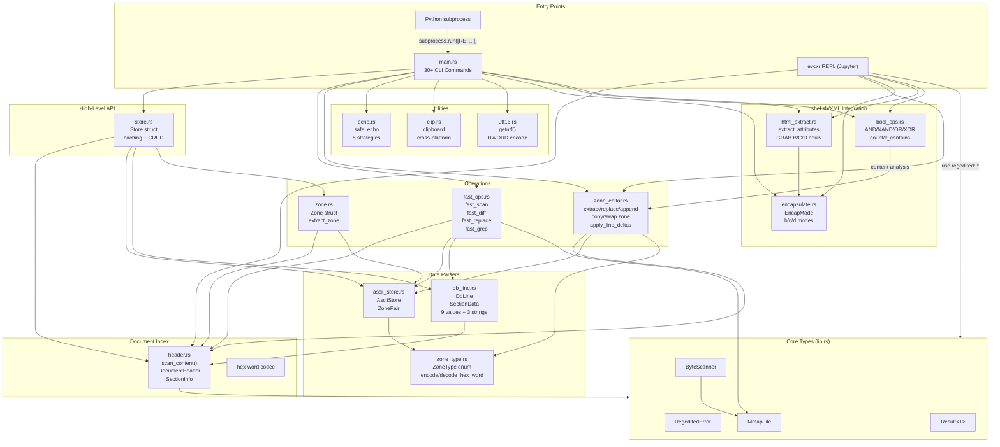
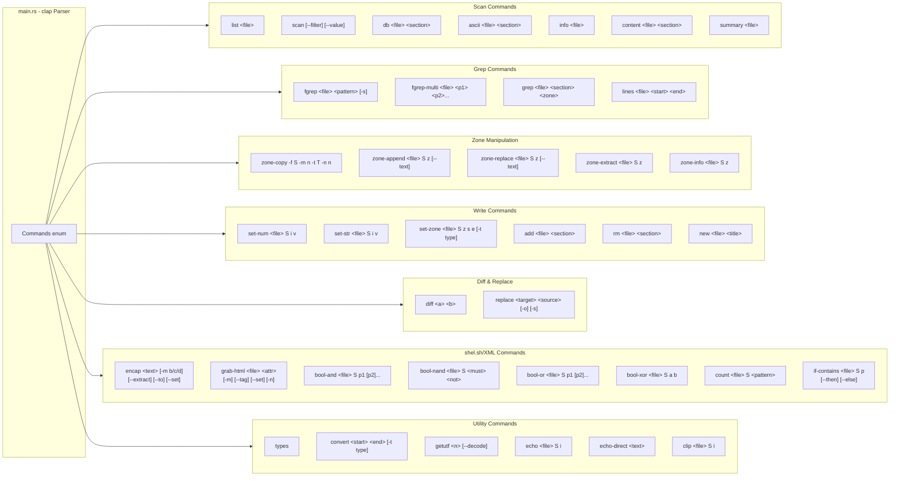
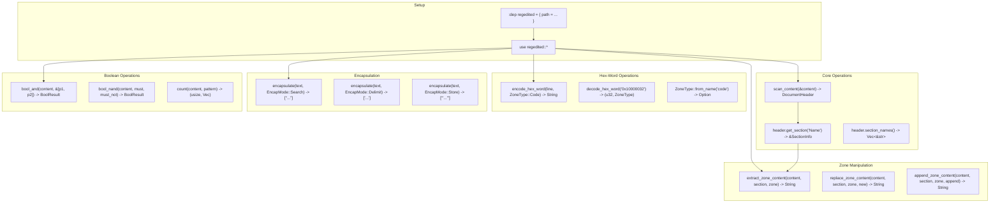
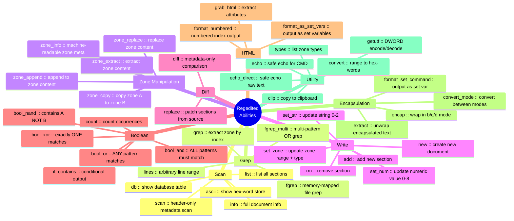
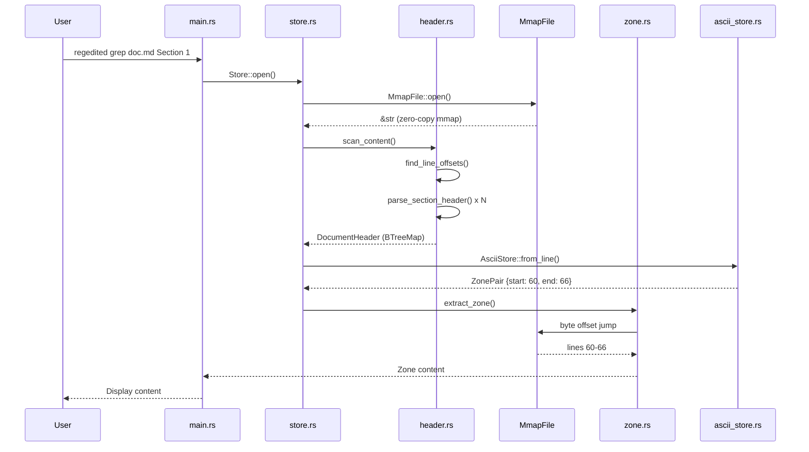
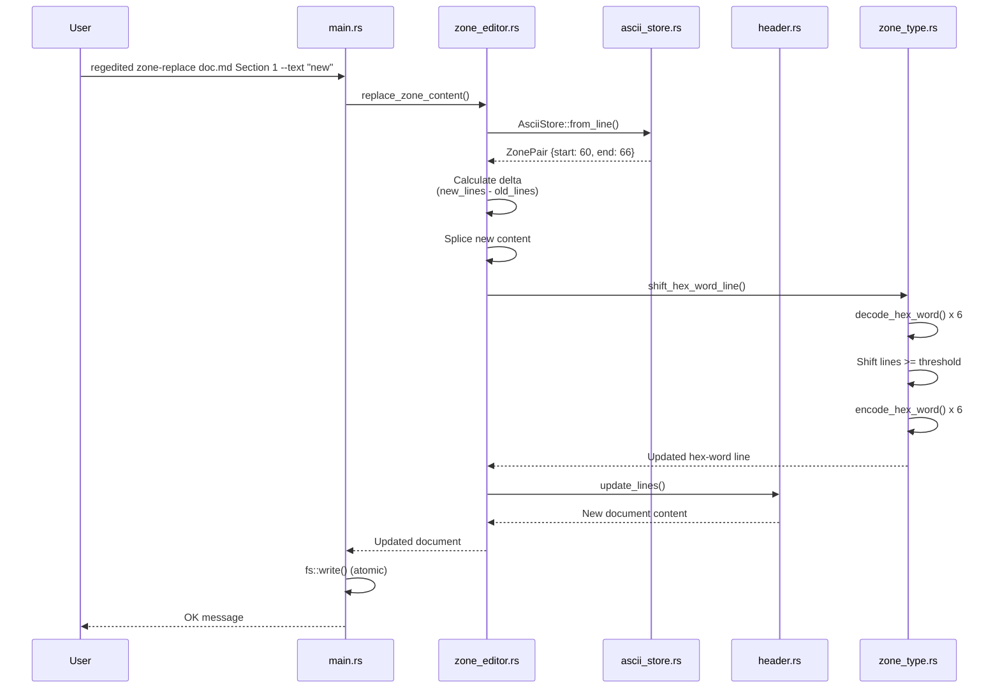

# Regedited Architecture Flowcharts

Comprehensive mermaid diagrams showing all modules, call paths, and abilities.

---

## Diagram 1: Module Dependency Graph

---

## Diagram 2: CLI Command Router

---

## Diagram 3: Python Integration Paths

```mermaid
flowchart TD
    subgraph PY_IN["Python Input"]
        py_sub["subprocess.run([RE, ...])"]
        py_cap["capture_output=True"]
    end

    subgraph PY_SCAN["Scanning"]
        ps1["re('scan', file)"]
        ps2["re('scan', file, '--filter', 'Code')"]
        ps3["re('scan', file, '--value', '0:10:100')"]
    end

    subgraph PY_ZONE["Zone Operations"]
        pz1["re('zone-extract', file, section, zone)"]
        pz2["re('zone-copy', file, '--from', A, '-m', 0, '--to', B, '-n', 1)"]
        pz3["re('zone-append', file, S, z, '--text', 'new')"]
        pz4["re('zone-replace', file, S, z, '--text', content)"]
    end

    subgraph PY_BOOL["Boolean Checks"]
        pb1["subprocess.run([RE, 'bool-and', f, S, p1, p2])"]
        pb2["result.returncode == 0 # TRUE"]
        pb3["result.returncode == 1 # FALSE"]
        pb4["re('if-contains', f, S, p, '--then-val', YES, '--else-val', NO)"]
    end

    subgraph PY_HTML["HTML Extraction"]
        ph1["re('grab-html', 'page.html', 'HREF', '--tag', 'a', '--mode', 'd', '--set', '0')"]
        ph2["Output: set “0aaa=[“'url'”]”"]
    end

    subgraph PY_ENC["Encapsulation"]
        pe1["re('encap', text, '--mode', 'd')"]
        pe2["re('encap', text, '--set', '0aaa', '--mode', 'd')"]
    end

    py_sub --> ps1
    py_sub --> pz1
    py_sub --> pb1
    py_sub --> ph1
    py_sub --> pe1

    pb1 --> pb2
    pb1 --> pb3
    ph1 --> ph2
```

---

## Diagram 4: evcxr REPL Integration

---

## Diagram 5: Function Abilities Map

---

## Diagram 6: Data Flow — Read Path

---

## Diagram 7: Data Flow — Write Path

