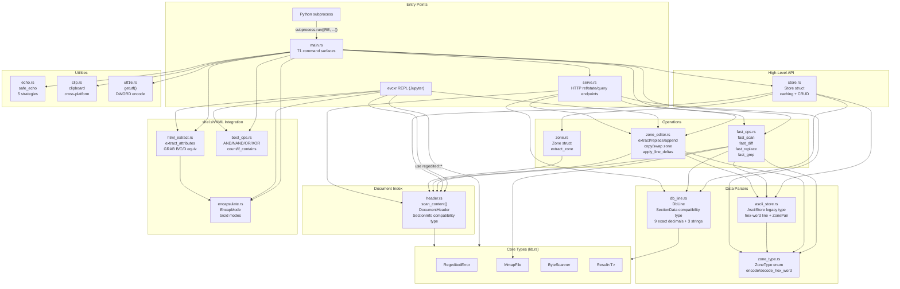
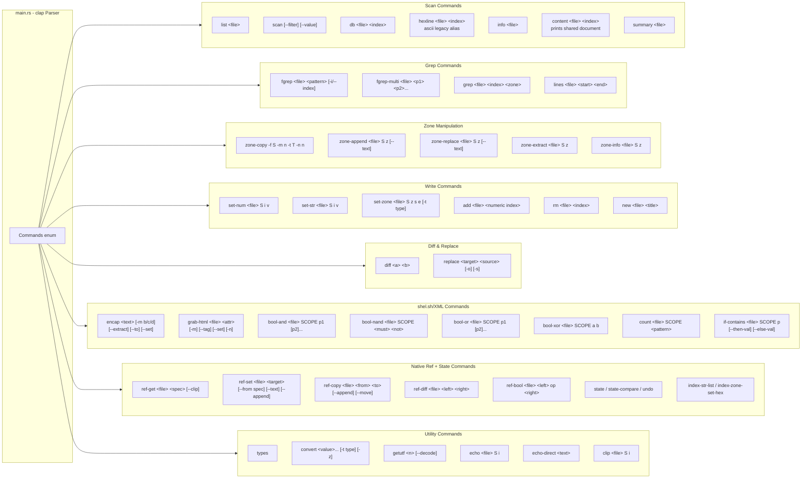
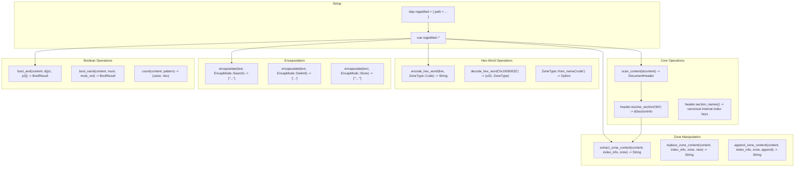
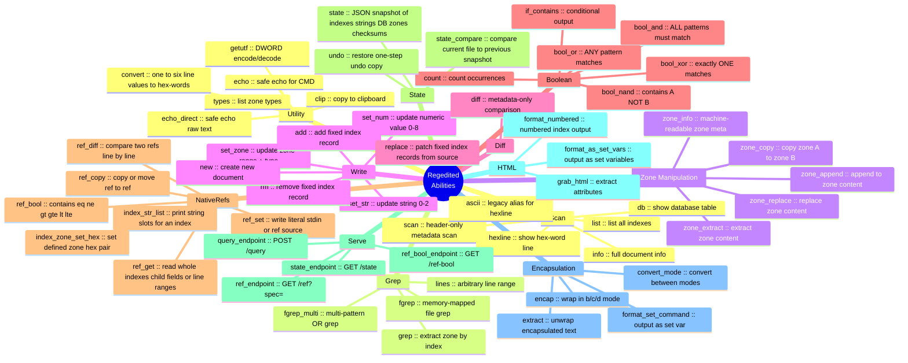
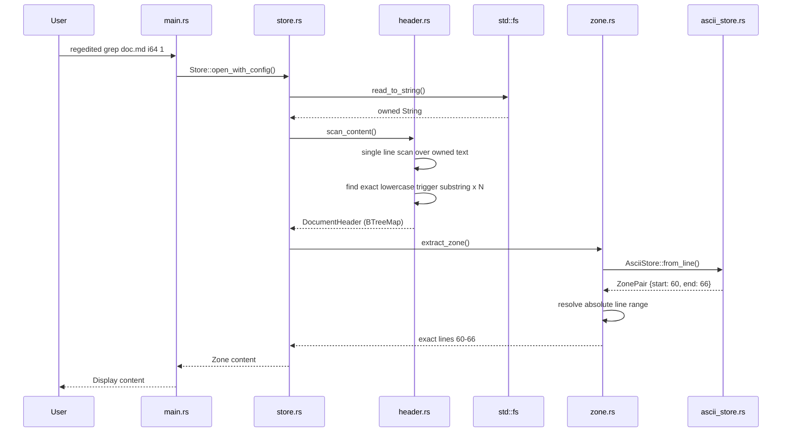
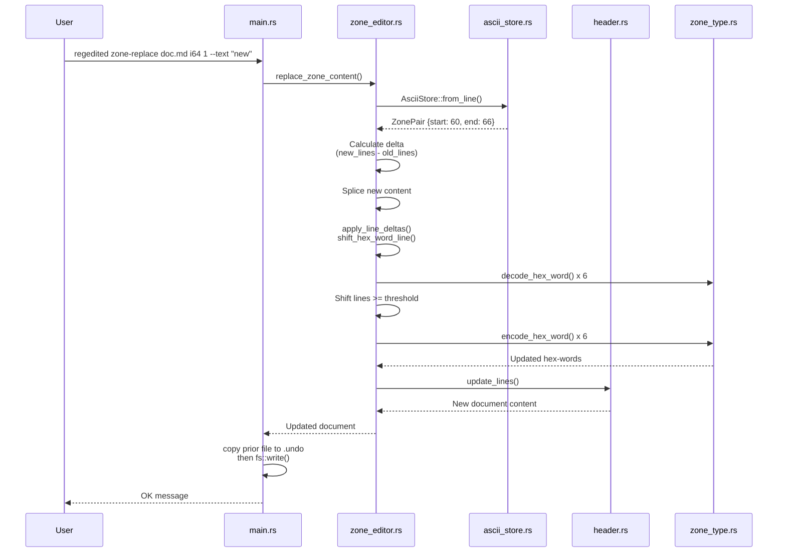
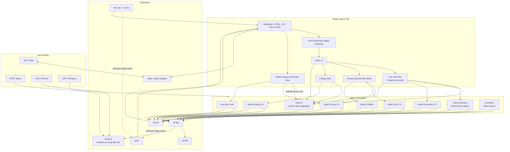

# Regedited Architecture Flowcharts

Mermaid diagrams showing the principal modules, call paths, and abilities.

---

## Diagram 1: Module Dependency Graph

```mermaid
flowchart TB
    subgraph ENTRY["Entry Points"]
        CLI["main.rs<br/>71 command surfaces"]
        PY["Python subprocess"]
        EVR["evcxr REPL (Jupyter)"]
        HTTP["serve.rs<br/>HTTP ref/state/query endpoints"]
    end

    subgraph CORE["Core Types (lib.rs)"]
        ERR["RegeditedError"]
        MMF["MmapFile"]
        BS["ByteScanner"]
        RSLT["Result&lt;T&gt;"]
    end

    subgraph INDEX["Document Index"]
        HDR["header.rs<br/>scan_content()<br/>DocumentHeader<br/>SectionInfo compatibility type"]
    end

    subgraph DATA["Data Parsers"]
        AS["ascii_store.rs<br/>AsciiStore legacy type<br/>hex-word line + ZonePair"]
        ZT["zone_type.rs<br/>ZoneType enum<br/>encode/decode_hex_word"]
        DL["db_line.rs<br/>DbLine<br/>SectionData compatibility type<br/>9 exact decimals + 3 strings"]
    end

    subgraph OPS["Operations"]
        FO["fast_ops.rs<br/>fast_scan<br/>fast_diff<br/>fast_replace<br/>fast_grep"]
        ZE["zone_editor.rs<br/>extract/replace/append<br/>copy/swap zone<br/>apply_line_deltas"]
        ZN["zone.rs<br/>Zone struct<br/>extract_zone"]
    end

    subgraph API["High-Level API"]
        ST["store.rs<br/>Store struct<br/>caching + CRUD"]
    end

    subgraph UTIL["Utilities"]
        EC["echo.rs<br/>safe_echo<br/>5 strategies"]
        CL["clip.rs<br/>clipboard<br/>cross-platform"]
        UT["utf16.rs<br/>getutf()<br/>DWORD encode"]
    end

    subgraph SHEL["shel.sh/XML Integration"]
        EN["encapsulate.rs<br/>EncapMode<br/>b/c/d modes"]
        HE["html_extract.rs<br/>extract_attributes<br/>GRAB B/C/D equiv"]
        BO["bool_ops.rs<br/>AND/NAND/OR/XOR<br/>count/if_contains"]
    end

    CLI --> ST
    CLI --> FO
    CLI --> ZE
    CLI --> EC
    CLI --> CL
    CLI --> UT
    CLI --> EN
    CLI --> HE
    CLI --> BO
    CLI --> HTTP

    PY -->|"subprocess.run([RE, ...])"| CLI
    EVR -->|"use regedited::*"| CORE
    EVR --> HDR
    EVR --> ZE
    EVR --> EN
    EVR --> HE
    EVR --> BO

    ST --> HDR
    ST --> AS
    ST --> DL
    ST --> ZN

    FO --> HDR
    FO --> AS
    FO --> DL
    FO --> ZT
    FO --> MMF

    ZE --> HDR
    ZE --> AS
    ZE --> ZT

    ZN --> HDR
    AS --> ZT
    DL --> CORE

    HE --> EN
    HTTP --> HDR
    HTTP --> FO
    HTTP --> DL
    HTTP --> ZE
    HTTP --> ZT

    HDR --> CORE
```

---

## Diagram 2: CLI Command Router

```mermaid
flowchart LR
    subgraph PARSER["main.rs - clap Parser"]
        C[Commands enum]
    end

    subgraph SCAN["Scan Commands"]
        c_list["list &lt;file&gt;"]
        c_scan["scan [--filter] [--value]"]
        c_db["db &lt;file&gt; &lt;index&gt;"]
        c_ascii["hexline &lt;file&gt; &lt;index&gt;<br/>ascii legacy alias"]
        c_info["info &lt;file&gt;"]
        c_content["content &lt;file&gt; &lt;index&gt;<br/>prints shared document"]
        c_summary["summary &lt;file&gt;"]
    end

    subgraph GREP["Grep Commands"]
        c_fgrep["fgrep &lt;file&gt; &lt;pattern&gt; [-i/--index]"]
        c_fgm["fgrep-multi &lt;file&gt; &lt;p1&gt; &lt;p2&gt;..."]
        c_grep["grep &lt;file&gt; &lt;index&gt; &lt;zone&gt;"]
        c_lines["lines &lt;file&gt; &lt;start&gt; &lt;end&gt;"]
    end

    subgraph ZONE["Zone Manipulation"]
        c_zcopy["zone-copy -f S -m n -t T -n n"]
        c_zapp["zone-append &lt;file&gt; S z [--text]"]
        c_zrep["zone-replace &lt;file&gt; S z [--text]"]
        c_zext["zone-extract &lt;file&gt; S z"]
        c_zinf["zone-info &lt;file&gt; S z"]
    end

    subgraph WRITE["Write Commands"]
        c_sn["set-num &lt;file&gt; S i v"]
        c_ss["set-str &lt;file&gt; S i v"]
        c_sz["set-zone &lt;file&gt; S z s e [-t type]"]
        c_add["add &lt;file&gt; &lt;numeric index&gt;"]
        c_rm["rm &lt;file&gt; &lt;index&gt;"]
        c_new["new &lt;file&gt; &lt;title&gt;"]
    end

    subgraph DIFF["Diff & Replace"]
        c_diff["diff &lt;a&gt; &lt;b&gt;"]
        c_replace["replace &lt;target&gt; &lt;source&gt; [-o] [-s]"]
    end

    subgraph SHEL_CMD["shel.sh/XML Commands"]
        c_encap["encap &lt;text&gt; [-m b/c/d]<br>[--extract] [--to] [--set]"]
        c_gh["grab-html &lt;file&gt; &lt;attr&gt;<br>[-m] [--tag] [--set] [-n]"]
        c_band["bool-and &lt;file&gt; SCOPE p1 [p2]..."]
        c_bnand["bool-nand &lt;file&gt; SCOPE &lt;must&gt; &lt;not&gt;"]
        c_bor["bool-or &lt;file&gt; SCOPE p1 [p2]..."]
        c_bxor["bool-xor &lt;file&gt; SCOPE a b"]
        c_count["count &lt;file&gt; SCOPE &lt;pattern&gt;"]
        c_if["if-contains &lt;file&gt; SCOPE p<br>[--then-val] [--else-val]"]
    end

    subgraph REF_CMD["Native Ref + State Commands"]
        c_refget["ref-get &lt;file&gt; &lt;spec&gt; [--clip]"]
        c_refset["ref-set &lt;file&gt; &lt;target&gt;<br>[--from spec] [--text] [--append]"]
        c_refcopy["ref-copy &lt;file&gt; &lt;from&gt; &lt;to&gt;<br>[--append] [--move]"]
        c_refdiff["ref-diff &lt;file&gt; &lt;left&gt; &lt;right&gt;"]
        c_refbool["ref-bool &lt;file&gt; &lt;left&gt; op &lt;right&gt;"]
        c_state["state / state-compare / undo"]
        c_istr["index-str-list / index-zone-set-hex"]
    end

    subgraph UTIL_CMD["Utility Commands"]
        c_types["types"]
        c_conv["convert &lt;value&gt;... [-t type] [-z]"]
        c_getutf["getutf &lt;n&gt; [--decode]"]
        c_echo["echo &lt;file&gt; S i"]
        c_echod["echo-direct &lt;text&gt;"]
        c_clip["clip &lt;file&gt; S i"]
    end

    C --> SCAN
    C --> GREP
    C --> ZONE
    C --> WRITE
    C --> DIFF
    C --> SHEL_CMD
    C --> REF_CMD
    C --> UTIL_CMD
```

---

## Diagram 3: Python Integration Paths

```mermaid
flowchart TD
    subgraph PY_IN["Python Input"]
        py_sub["subprocess.run([RE, ...])"]
        py_cap["capture_output=True"]
    end

    subgraph PY_SCAN["Scanning"]
        ps1["re('scan', file)"]
        ps2["re('scan', file, '--filter', '100')"]
        ps3["re('scan', file, '--value', '0:10:100')"]
    end

    subgraph PY_ZONE["Zone Operations"]
        pz1["re('zone-extract', file, index, zone)"]
        pz2["re('zone-copy', file, '--from', A, '-m', 0, '--to', B, '-n', 1)"]
        pz3["re('zone-append', file, S, z, '--text', 'new')"]
        pz4["re('zone-replace', file, S, z, '--text', content)"]
    end

    subgraph PY_BOOL["Boolean Checks"]
        pb1["subprocess.run([RE, 'bool-and', f, exact_ref, p1, p2])"]
        pb2["result.returncode == 0 # TRUE"]
        pb3["result.returncode == 1 # FALSE"]
        pb4["re('if-contains', f, exact_ref, p, '--then-val', YES, '--else-val', NO)"]
    end

    subgraph PY_HTML["HTML Extraction"]
        ph1["re('grab-html', 'page.html', 'HREF', '--tag', 'a', '--mode', 'd', '--set', '0')"]
        ph2["Output: set “0aaa=[“'url'”]”"]
    end

    subgraph PY_ENC["Encapsulation"]
        pe1["re('encap', text, '--mode', 'd')"]
        pe2["re('encap', text, '--set', '0aaa', '--mode', 'd')"]
    end

    py_sub --> ps1
    py_sub --> pz1
    py_sub --> pb1
    py_sub --> ph1
    py_sub --> pe1

    pb1 --> pb2
    pb1 --> pb3
    ph1 --> ph2
```

---

## Diagram 4: evcxr REPL Integration

```mermaid
flowchart TD
    subgraph EVR_SETUP["Setup"]
        e_dep[":dep regedited = { path = ... }"]
        e_use["use regedited::*"]
    end

    subgraph EVR_CORE["Core Operations"]
        e1["scan_content(&content) -> DocumentHeader"]
        e2["header.resolve_section('i64') -> &SectionInfo"]
        e3["header.section_names() -> canonical internal index keys"]
    end

    subgraph EVR_HEX["Hex-Word Operations"]
        e4["encode_hex_word(line, ZoneType::Code) -> String"]
        e5["decode_hex_word('0x10000032') -> (u32, ZoneType)"]
        e6["ZoneType::from_name('code') -> Option<ZoneType>"]
    end

    subgraph EVR_ZONE["Zone Manipulation"]
        e7["extract_zone_content(content, index_info, zone) -> String"]
        e8["replace_zone_content(content, index_info, zone, new) -> String"]
        e9["append_zone_content(content, index_info, zone, append) -> String"]
    end

    subgraph EVR_ENCAP["Encapsulation"]
        e10["encapsulate(text, EncapMode::Search) -> [“...”]"]
        e11["encapsulate(text, EncapMode::Delimit) -> ['...']"]
        e12["encapsulate(text, EncapMode::Store) -> [“'...'”]"]
    end

    subgraph EVR_BOOL["Boolean Operations"]
        e13["bool_and(content, &[p1, p2]) -> BoolResult"]
        e14["bool_nand(content, must, must_not) -> BoolResult"]
        e15["count(content, pattern) -> (usize, Vec)"]
    end

    e_dep --> e_use
    e_use --> e1
    e_use --> e4
    e_use --> e7
    e_use --> e10
    e_use --> e13

    e1 --> e2
    e2 --> e7
```

---

## Diagram 5: Function Abilities Map

```mermaid
mindmap
  root((Regedited<br/>Abilities))
    Scan
      list :: list all indexes
      scan :: header-only metadata scan
      db :: show database table
      hexline :: show hex-word line
      ascii :: legacy alias for hexline
      info :: full document info
    Grep
      fgrep :: memory-mapped file grep
      fgrep_multi :: multi-pattern OR grep
      grep :: extract zone by index
      lines :: arbitrary line range
    Zone[Zone Manipulation]
      zone_extract :: extract zone content
      zone_replace :: replace zone content
      zone_append :: append to zone content
      zone_copy :: copy zone A to zone B
      zone_info :: machine-readable zone meta
    Write
      set_num :: update numeric value 0-8
      set_str :: update string 0-2
      set_zone :: update zone range + type
      add :: add fixed index record
      rm :: remove fixed index record
      new :: create new document
    Diff
      diff :: metadata-only comparison
      replace :: patch fixed index records from source
    Boolean
      bool_and :: ALL patterns must match
      bool_nand :: contains A NOT B
      bool_or :: ANY pattern matches
      bool_xor :: exactly ONE matches
      count :: count occurrences
      if_contains :: conditional output
    NativeRefs
      ref_get :: read whole indexes child fields or line ranges
      ref_set :: write literal stdin or ref source
      ref_copy :: copy or move ref to ref
      ref_diff :: compare two refs line by line
      ref_bool :: contains eq ne gt gte lt lte
      index_str_list :: print string slots for an index
      index_zone_set_hex :: set defined zone hex pair
    State
      state :: JSON snapshot of indexes strings DB zones checksums
      state_compare :: compare current file to previous snapshot
      undo :: restore one-step undo copy
    Serve
      state_endpoint :: GET /state
      ref_endpoint :: GET /ref?spec=
      ref_bool_endpoint :: GET /ref-bool
      query_endpoint :: POST /query
    HTML
      grab_html :: extract attributes
      format_as_set_vars :: output as set variables
      format_numbered :: numbered index output
    Encapsulation
      encap :: wrap in b/c/d mode
      extract :: unwrap encapsulated text
      convert_mode :: convert between modes
      format_set_command :: output as set var
    Utility
      types :: list zone types
      convert :: one to six line values to hex-words
      getutf :: DWORD encode/decode
      echo :: safe echo for CMD
      echo_direct :: safe echo raw text
      clip :: copy to clipboard
```

---

## Diagram 6: Data Flow — Read Path

```mermaid
sequenceDiagram
    participant User
    participant CLI as main.rs
    participant Store as store.rs
    participant Header as header.rs
    participant FS as std::fs
    participant Zone as zone.rs
    participant Ascii as ascii_store.rs

    User->>CLI: regedited grep doc.md i64 1
    CLI->>Store: Store::open_with_config()
    Store->>FS: read_to_string()
    FS-->>Store: owned String
    Store->>Header: scan_content()
    Header->>Header: single line scan over owned text
    Header->>Header: find exact lowercase trigger substring x N
    Header-->>Store: DocumentHeader (BTreeMap)
    Store->>Zone: extract_zone()
    Zone->>Ascii: AsciiStore::from_line()
    Ascii-->>Zone: ZonePair {start: 60, end: 66}
    Zone->>Zone: resolve absolute line range
    Zone-->>Store: exact lines 60-66
    Store-->>CLI: Zone content
    CLI-->>User: Display content
```

---

## Diagram 7: Data Flow — Write Path

```mermaid
sequenceDiagram
    participant User
    participant CLI as main.rs
    participant ZE as zone_editor.rs
    participant AS as ascii_store.rs
    participant HDR as header.rs
    participant ZT as zone_type.rs

    User->>CLI: regedited zone-replace doc.md i64 1 --text "new"
    CLI->>ZE: replace_zone_content()
    ZE->>AS: AsciiStore::from_line()
    AS-->>ZE: ZonePair {start: 60, end: 66}
    ZE->>ZE: Calculate delta<br/>(new_lines - old_lines)
    ZE->>ZE: Splice new content
    ZE->>ZE: apply_line_deltas()<br/>shift_hex_word_line()
    ZE->>ZT: decode_hex_word() x 6
    ZE->>ZE: Shift lines >= threshold
    ZE->>ZT: encode_hex_word() x 6
    ZT-->>ZE: Updated hex-words
    ZE->>HDR: update_lines()
    HDR-->>ZE: New document content
    ZE-->>CLI: Updated document
    CLI->>CLI: copy prior file to .undo<br/>then fs::write()
    CLI-->>User: OK message
```

---

## Diagram 8: Native Ref Specs, State, and Serve Runtime

```mermaid
flowchart TB
    subgraph SOURCE["Single Source File"]
        FILE["Markdown / HTML / JS / misc text file"]
        HDRS["exact lowercase trigger substring"]
        IDX["index: N"]
        ASCII["hex-word line<br/>3 typed zone pairs"]
        DB["9 exact decimal DB values"]
        STR["3 string slots"]
        BODY["shared opaque document lines"]
    end

    subgraph REFS["Native Ref Specs"]
        R0["index:N<br/>whole-index aggregate"]
        R1["index:N:string:1-3"]
        R2["index:N:db:1-9"]
        R3["index:N:dbline"]
        R4["index:N:hexline<br/>index:N:ascii legacy"]
        R5["index:N:zone:1-3"]
        R6["index:N:zonehex:1-3"]
        R7["hex:start..end"]
        R8["text:literal<br/>literal source"]
    end

    subgraph OPS["Operations"]
        GET["ref-get"]
        SET["ref-set"]
        COPY["ref-copy / --move"]
        DIFF["ref-diff"]
        BOOL["ref-bool<br/>contains eq ne gt gte lt lte"]
        SNAP["state / state-compare"]
        UNDO["undo"]
    end

    subgraph HTTP["Serve Mode"]
        HSTATE["GET /state"]
        HREF["GET /ref?spec="]
        HBOOL["GET /ref-bool"]
        HQUERY["POST /query"]
    end

    FILE --> HDRS --> IDX
    IDX --> ASCII
    IDX --> DB
    IDX --> STR
    FILE --> BODY

    IDX --> R0
    ASCII --> R0
    DB --> R0
    STR --> R0
    BODY -->|defined zones only| R0
    STR --> R1
    DB --> R2
    DB --> R3
    ASCII --> R4
    ASCII --> R6
    ASCII --> R5
    BODY --> R5
    BODY --> R7

    R0 --> GET
    R1 --> GET
    R2 --> GET
    R3 --> GET
    R4 --> GET
    R5 --> GET
    R6 --> GET
    R7 --> GET
    R8 --> GET
    R1 --> SET
    R2 --> SET
    R3 --> SET
    R4 --> SET
    R5 --> SET
    R6 --> SET
    R7 --> SET
    R8 --> SET
    GET --> DIFF
    GET --> BOOL
    SET -. selected range writes .-> UNDO
    COPY -. selected range writes .-> UNDO
    SET --> FILE
    COPY --> FILE
    FILE --> SNAP
    UNDO --> FILE

    HTTP --> HSTATE
    HTTP --> HREF
    HTTP --> HBOOL
    HTTP --> HQUERY
    HSTATE --> SNAP
    HREF --> REFS
    HBOOL --> BOOL
    HQUERY --> BOOL
```
